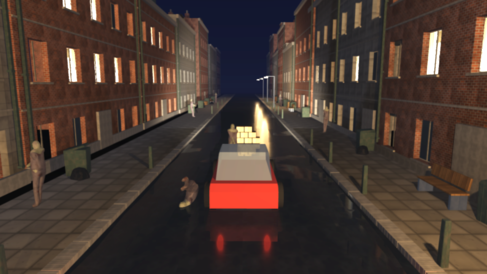
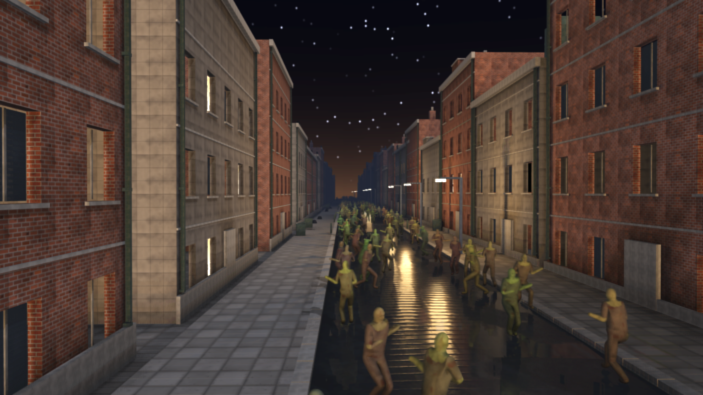
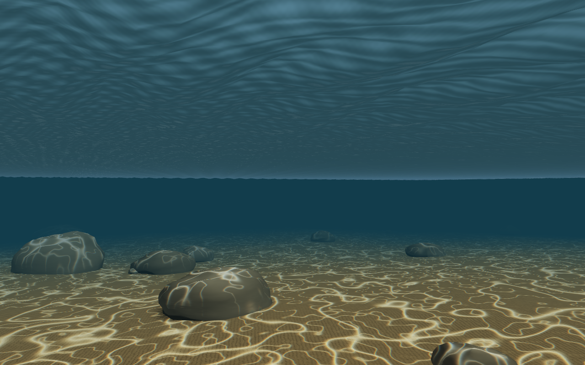
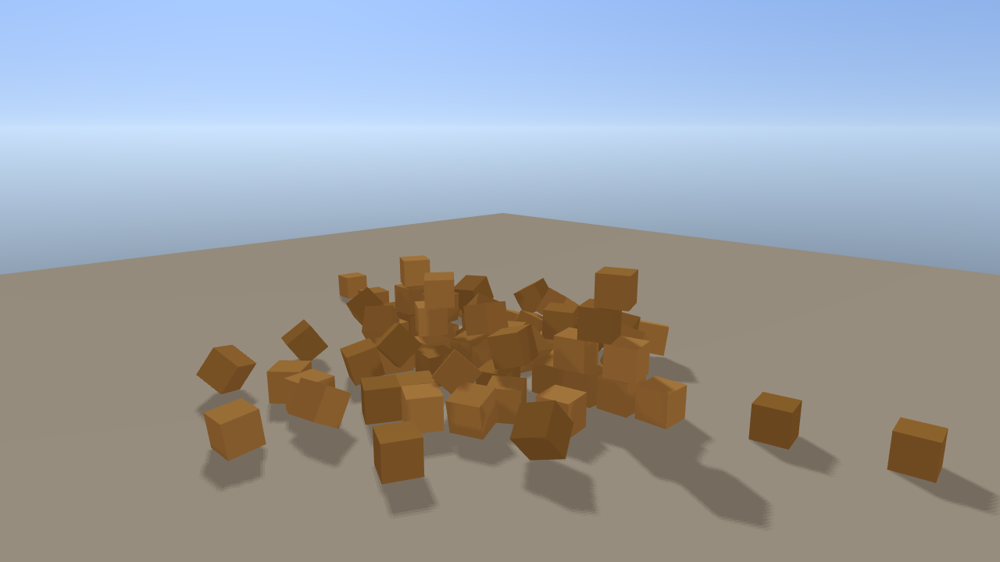
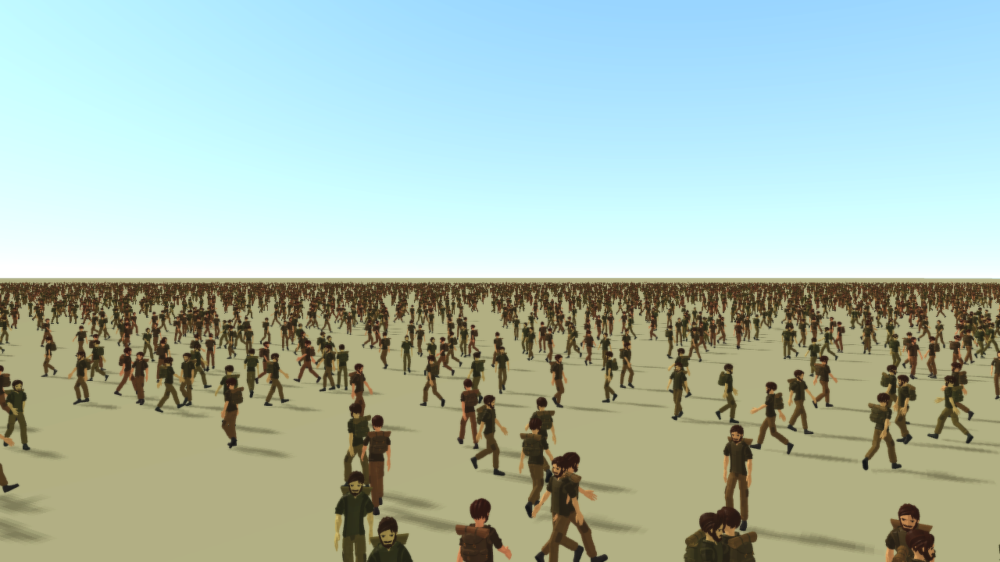
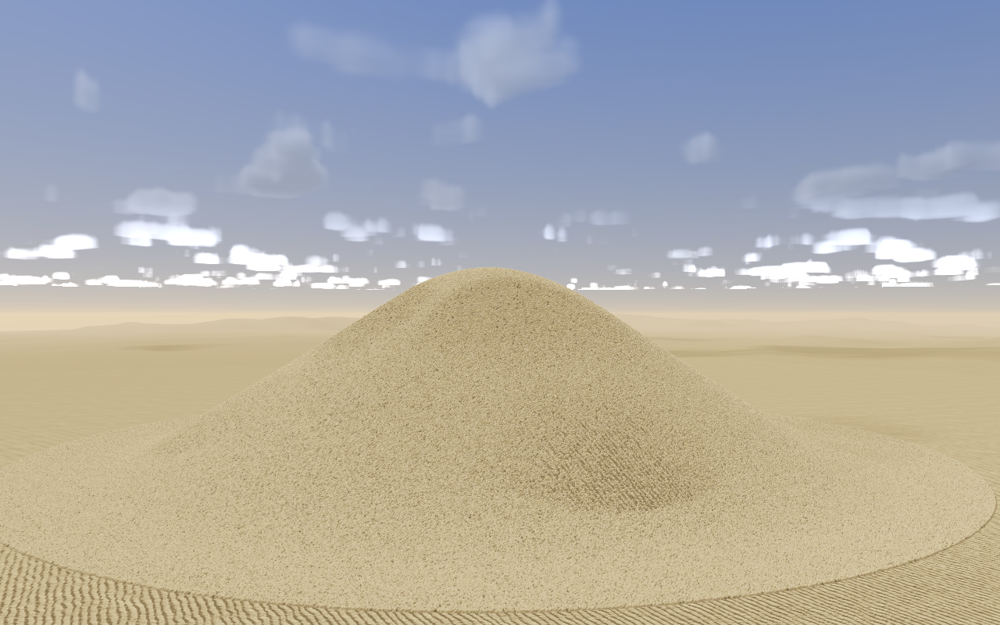
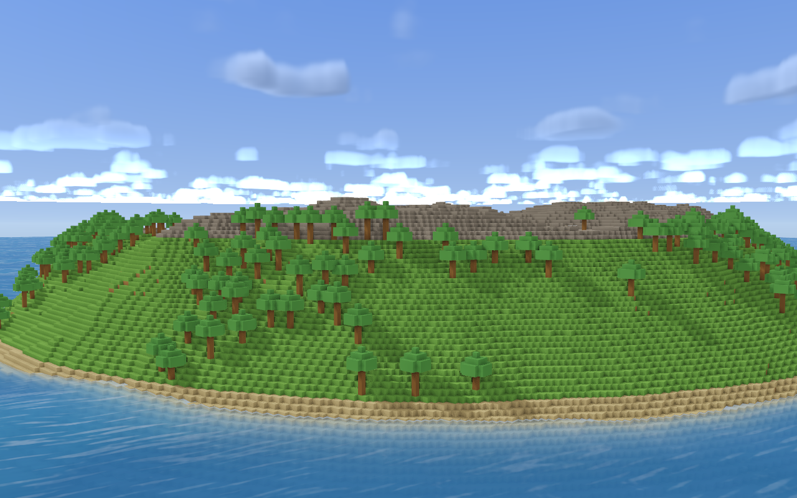
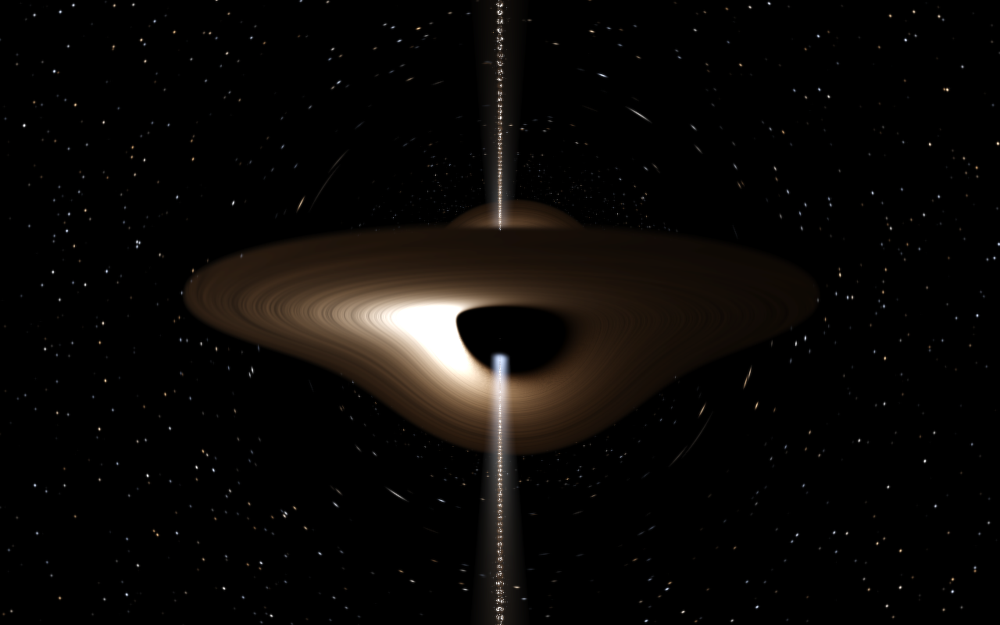

# ae3d

[](https://github.com/nicolas-maman/ae3d/actions/workflows/ci.yml)
[](LICENSE)

**A 3D engine written in Aether, built to be driven by programs.** One
scene API over Vulkan and OpenGL; a rigid body engine of its own in the
loop; skinned crowds of half a million; a Blender-to-engine pipeline; a
scene editor; and a control channel through which a program, a test or an
AI agent builds a scene, reads back what was drawn and checks the frame by
number rather than by eye.



<sub>`examples/street_drive.ae`: the street from the Blender pipeline, every building and kerb colliding as its own triangles, every crate and bench as the convex hull of its mesh, a car on suspension, drive and steering joints, and the pipeline's zombie figures standing as sprung ragdolls that wear them -- the rig driven by the bodies -- until the car reaches them. 501 bodies stepped over every core; 144 fps hidden on an RTX 4070 Ti at 1280×720 with ray-traced shadows on, the physics 0.09 ms of the frame.</sub>

ae3d is the successor to [Gopher3D](https://github.com/nicolas-maman/gopher3D),
the same author's Go engine, rebuilt in [Aether](https://github.com/aether-lang-dev/aether)
and taken further. The engine is Aether from the loop to the crowd's
kernels; what remains in C is there for one stated reason each
([native/README.md](native/README.md)).

## What it does

| | |
|---|---|
| **Two renderers, one interface** | Vulkan by default, OpenGL 4.1 at parity: one test draws the same scene through both and holds them to 0.7% of channels. DirectX 12 and Metal are the next implementations of the same vtable. |
| **Physically based shading** | Metallic/roughness materials, sixteen directional, point or spot lights a frame from any number, normal mapping, texel-snapped shadow maps, SSAO, screen-space reflections, ray-traced shadows with penumbrae and ambient occlusion by ray (Vulkan ray query), MSAA, TAA, DLSS, FXAA, bloom, ACES with an exposure that follows the frame, fog, wet surfaces. |
| **A sky by the hour** | `engine_set_time_of_day(hours)` places the sun and derives the light, the fog and a procedural sky. Volumetric clouds from baked Perlin-Worley textures, lit through a sun march and shadowing the ground, in about 1.5 ms. |
| **Weather and water** | Rain, snow, dust and storm over any scene: a hundred thousand particles stepped over the job pool, the sky gone overcast, lightning. A Gerstner sea with dispersion, fresnel, whitecaps and caustics from underneath. |
| **Physics** | [aephysics](https://github.com/aether-lang-dev/aephysics), a rigid body engine written in Aether on Box3D's design -- hulls, meshes, joints of every kind, ragdolls that wear a skinned figure, vehicles, continuous collision, a parallel step that is the same to the bit at any thread count -- in the scene as a `Rigidbody` component and colliders on game objects. A character controller walks, runs and jumps up kerbs and stairs and off slopes: ten thousand random moves through the street end no deeper than the solver's 5 mm slop. |
| **Crowds** | A figure's walk baked into a pose bank, every instance posed in the vertex shader from its own phase, three tiers by distance ending in an impostor lit by the scene's lights, the sort on the device and the draws indirect. Half a million zombies in a handful of draws at 79 fps, feet planted, the simulation over every core. |
| **Navigation** | A flow field over the ground: one flood from the target, a direction per cell, read by every figure every frame. |
| **Models from anywhere** | glTF 2.0 with skins and animations, OBJ, and the engine's own Blender export with a manifest; any glTF figure is a horde in one call. Skies, sand and palettes painted from the engine's own noise. |
| **Voxels and terrain** | Voxel worlds as only the faces that show; surface nets over a distance field for smooth terrain. |
| **An engine you can ask** | `AE3D_AGENT=port` opens a JSON channel: read and change the scene, hold a frame, read its pixels, trace a model from its Blender object to the pixels it landed on. |
| **Natural motion** | `ae3d.motion`, an active ragdoll on any dressed figure: the animation played by joint motors within an adult's torque budget, a blow that knocks it off its pose and back or down, a struck limb that goes weak and recovers, a fall with the hands out and the head tucked, and getting up again face up or face down, handed back to the animation with nothing to jump ([docs/motion.md](docs/motion.md)). |
| **Multiplayer in the engine** | `ae3d.net`: host or join over TCP or an in-process loopback with simulated latency, jitter and loss; networked objects replicated and interpolated, held to within a millimetre and a half of the host over a perfect link; players that walk the instant their client asks, predicted and reconciled against the host; snapshots sent as changes against the last one each client acknowledged, and only what is near it ([docs/networking.md](docs/networking.md)). |
| **Input as a game names it** | Actions and axes bound once to keys, mouse and gamepad, read by name from any script, injectable from a test or an agent. |
| **An editor** | Hierarchy, inspector, gizmos, terrain sculpting, physics bodies and a Simulate button, undo, scene files; opens any program's scene (`AE3D_SCENE_OUT`); one dark theme on every platform. |

Each row is a page in [docs/](docs/README.md) with the reasoning and the
measurement behind it.

## Quick start

Requirements: the [Aether toolchain](https://github.com/aether-lang-dev/aether)
(`ae`, `aetherc`) on `PATH`, a C compiler, GLFW 3, zlib, `pkg-config` and
the Vulkan headers. The Vulkan loader is opened at run time; a driver is
optional.

```bash
brew install glfw molten-vk vulkan-loader                        # macOS
sudo apt install libglfw3-dev libvulkan-dev mesa-vulkan-drivers  # Debian/Ubuntu
pacman -S mingw-w64-ucrt-x86_64-{gcc,glfw,zlib,pkgconf,vulkan-headers,vulkan-loader}  # Windows, MSYS2 UCRT64
```

```bash
git submodule update --init                                       # deps/aephysics, the physics engine
./build.sh examples/spinning_cube.ae && ./build/spinning_cube
./build.sh examples/street_drive.ae  && ./build/street_drive      # W/S A/D space shift; drives itself if left alone
./build.sh examples/zombie_city.ae   && AE3D_CROWD=100000 ./build/zombie_city
AE3D_API=opengl ./build/zombie_city                               # the other renderer
```

Every program honours the same environment: `AE3D_FRAMES=n` to stop after
`n` frames, `AE3D_HIDDEN=1` for no window, `AE3D_SNAPSHOT=frame.png` for
the last frame, `AE3D_PERF=1` for the frame's cost by stage, `AE3D_RAYS=1`
for ray-traced shadows, `AE3D_DLSS=n`, `AE3D_AGENT=port` for the channel.
The full list, the build's options and the CI gate are in
[docs/building.md](docs/building.md). `./ci.sh` is the whole gate: every
module type-checked, every suite and benchmark run, every example driven
hidden, the demo scene critiqued on both backends and held to its recorded
frame cost.

## Writing a program

A program is written the way a Unity or gopher3D game is: game objects in
the engine's scene, scripts on them with Unity's phases under Unity's
names, and the engine calling the phases.

```aether
import ae3d.core
import ae3d.engine
import ae3d.behaviour
import ae3d.loader

struct Spinner { pitch: float, yaw: float }        // the script's own state

start(state: ptr, go: *GameObject) {               // once, first frame
    cam = engine.engine_camera(engine.of(go))
    core.camera_look_at(cam, behaviour.object_position(go))
}

update(state: ptr, go: *GameObject, delta: float) { // every frame
    spin = state as *Spinner
    core.model_rotate(behaviour.object_model(go), spin.pitch * delta, spin.yaw * delta, 0.0)
}

main() {
    e = engine.engine_new()
    cube = loader.cube(1.0)
    core.model_set_scale(cube, 20.0, 20.0, 20.0)
    spinner = Spinner { pitch: 18.0, yaw: 30.0 }
    object = engine.object(e, "Cube", cube)                     // a game object with a mesh
    engine.script(object, "Spinner", &spinner, start, update)   // AddComponent
    engine.engine_run(e)
    engine.engine_free(e)                                       // the scene and its models go with it
}
```

The phases each frame: `fixed_update` as many times as the fixed step
fits, `update` once, `late_update` after the draw; `start` once on the
first frame the object is in the scene. Physics is one more component:

```aether
p = physics.attach(e)
physics.rigidbody(crate, physics.DYNAMIC)
physics.box_collider(crate, core.vec3(0.5, 0.5, 0.5), physics.material(0.6, 0.0))
```

How the loop, the behaviours, the renderers and the job pool fit
together: [docs/architecture.md](docs/architecture.md).

## Scenes

| | |
|---|---|
|  |  |
| `zombie_city` -- the city and its horde, three tiers by distance, `AE3D_HUNT=1` and it closes on the camera over the flow field | `caustics` -- the seabed under a Gerstner swell, the light refracted through the surface every frame |
|  |  |
| `physics` -- four of the physics engine's reference scenes, every body a game object | `gltf_crowd` -- a public glTF figure, its walk baked, a hundred thousand of it sorted on the device |
|  |  |
| `smooth_terrain` under `AE3D_WEATHER=rain\|storm\|dust\|snow` | `sand` -- a million grains you plough into a heap that slumps to its angle of repose |
|  |  |
| `voxel_world` -- 3.9 million voxels as 259,000 faces in one draw | `black_hole` -- Kerr geodesics per pixel, the shadow checked against √27 M |

| Example | What it shows |
|---|---|
| `street_drive.ae` | The street driven, and walked: mesh and hull colliders, a car on wheel joints, skinned figures worn by sprung ragdolls, hit events; E gets out of the car and walks the street first-person on a character controller; the bystanders are active ragdolls the car knocks back or down, and they get up again ([docs/physics.md](docs/physics.md)) |
| `physics.ae` | `AE3D_PHYSICS_SCENE=pyramid\|pile\|ragdolls\|cloth`, the reference's scenes |
| `net_walk.ae`, `net_cars.ae` | Multiplayer: `./build/net_walk` hosts, `AE3D_NET=join:127.0.0.1 ./build/net_walk` joins; players walk a plaza, predicted, or eight cars round a ring, interpolated ([docs/networking.md](docs/networking.md)) |
| `zombie_city.ae` | The city and its horde; `AE3D_CROWD` sets the count, `AE3D_WEATHER` the weather, `AE3D_HUNT=1` the hunt |
| `gltf_crowd.ae` | Any glTF figure as a horde: `AE3D_CROWD=100000 ./build/gltf_crowd figure.glb Walk` |
| `gltf_viewer.ae` | Any glTF on a floor under a sun, playing one of its animations |
| `caustics.ae`, `smooth_terrain.ae`, `voxel_world.ae`, `sand.ae` | Water, terrain, voxels, a million point instances |
| `black_hole.ae` | Kerr geodesics per pixel ([docs/black-hole.md](docs/black-hole.md)) |
| `lights.ae`, `models.ae`, `blender_pipeline.ae`, `backend_switch.ae`, `spinning_cube.ae` | Materials and lights, OBJ, the Blender export, the two renderers, the smallest program |

Every scene is verified the way the engine is: from a sweep of camera
positions and by numbers read back over the channel, not from one still
([docs/testing.md](docs/testing.md)).

## The pipeline and the editor

The zombie street is not a downloaded asset: `tools/blender/make_zombie_street.py`
builds the buildings, the road, the rigged and textured zombie and its
walk in a headless Blender, and `ae3d_export.py` writes a deterministic,
manifested export the engine loads. Every build then runs a critique that
holds the scene to a standard (texel density, normal maps, planted feet,
lit windows) and a frame budget that fails on one extra triangle
([docs/pipeline.md](docs/pipeline.md)).

`editor/` is a scene editor whose chrome is
[aether-ui](https://github.com/aether-lang-dev/aether-ui): a hierarchy, an
asset browser, an inspector, a viewport you orbit and click in, a gizmo, a
sculpting brush, behaviours on objects, bodies and colliders with a
Simulate button that runs the physics in the viewport and puts the scene
back, undo ([docs/editor.md](docs/editor.md)). Any program's scene opens
in it: `AE3D_SCENE_OUT=path` writes the scene a program built, bodies
included, and the editor takes the file as its argument.

```bash
git clone https://github.com/aether-lang-dev/aether-ui.git ../aether-ui
./editor/build_editor.sh && ./build/ae3d_editor
AE3D_SCENE_OUT=build/street.json ./build/street_drive && ./build/ae3d_editor build/street.json
```

## Layout

```
src/ae3d/     the engine: core, engine, behaviour, input, jobs, vulkan, gl, shaders, physics,
              crowd, horde, nav, ecs, gltf, assets, weather, water, sky, voxel, terrain,
              agent, probe, script, scene, ... one module a directory
native/       the C that remains, by role: gpu/, image/, platform/, dlss/
deps/         aephysics, the physics engine, as a submodule
examples/     runnable scenes            tests/       one program a suite
benchmarks/   per-frame cost, no window  tools/       the agent client, viewer, critique, bench, bakers
scripts/      export, critique, perf     editor/      the scene editor
docs/         the documentation, docs/images/ its pictures
```

## Documentation

[Architecture](docs/architecture.md) ·
[Building](docs/building.md) ·
[Rendering](docs/rendering.md) ·
[Physics](docs/physics.md) ·
[Crowds and navigation](docs/crowds.md) ·
[Pipeline](docs/pipeline.md) ·
[Agent channel](docs/agent.md) ·
[Networking](docs/networking.md) ·
[Natural motion](docs/motion.md) ·
[Editor](docs/editor.md) ·
[Performance](docs/performance.md) ·
[Testing](docs/testing.md) ·
[Writing Aether](docs/writing-aether.md) ·
[Changelog](CHANGELOG.md)

## Status and roadmap

The engine is built toward an open-world game it has to carry -- hordes of
the real animated zombie, extreme weather, the best picture the hardware
gives, multiplayer -- and the map of what that still needs is
[#326](https://github.com/nicolas-maman/ae3d/issues/326): every line
becomes an issue when it is next and lands as a measured, tested pull
request. Done on that map:
- the crowd's sort on the device and its indirect draws;
- motion vectors, render scale, DLSS, and ray-traced shadows with the
  crowd in them;
- weather, physics and navigation;
- a character controller;
- natural motion: active ragdolls that fall the way a person does and get
  up ([#414](https://github.com/nicolas-maman/ae3d/issues/414));
- multiplayer in the engine: snapshots as deltas, relevance, predicted
  players, events and objects made mid-game
  ([#413](https://github.com/nicolas-maman/ae3d/issues/413));
- animated figures in scenes and the editor
  ([#439](https://github.com/nicolas-maman/ae3d/issues/439));
- input mapping;
- the OpenGL renderer in Aether.

Next:
- the rest of the Vulkan renderer in Aether, a part at a time on Aether's
  own bindings ([#402](https://github.com/nicolas-maman/ae3d/issues/402));
- multiplayer on datagrams once Aether has them
  ([aether#2201](https://github.com/aether-lang-dev/aether/issues/2201)),
  and a horde simulated on every peer;
- the prompt-to-scene pipeline through the engine
  ([#416](https://github.com/nicolas-maman/ae3d/issues/416));
- audio ([#415](https://github.com/nicolas-maman/ae3d/issues/415)),
  clustered lighting and streaming tiles;
- DirectX 12 ([#311](https://github.com/nicolas-maman/ae3d/issues/311))
  and Metal ([#312](https://github.com/nicolas-maman/ae3d/issues/312))
  beside Vulkan.

## Credits

ae3d continues [Gopher3D](https://github.com/nicolas-maman/gopher3D) (MIT),
the same author's earlier Go engine: the architecture, the GLSL programs,
the material and lighting model and the OBJ loader's behaviour carry over;
the Go served as the reference and none of it was copied. Built with
[GLFW](https://www.glfw.org/) and [Vulkan](https://www.vulkan.org/) (MoltenVK
on macOS); the image decoders are Aether ports of
[stb_image](https://github.com/nothings/stb)'s. See [NOTICE](NOTICE)
and [THIRD_PARTY_LICENSES.md](THIRD_PARTY_LICENSES.md).

## License

MIT, see [LICENSE](LICENSE).
