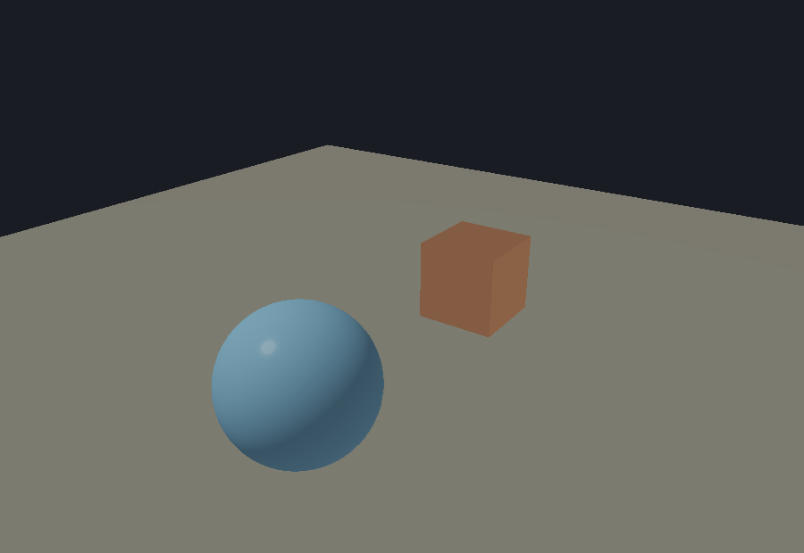

# ae3d

A 3D rendering engine in [Aether](https://github.com/aether-lang-dev/aether), with a
switchable OpenGL 4.1 / Vulkan backend.

This is a port of [Gopher3D](https://github.com/nicolas-maman/gopher3D), a Go
engine, to Aether and C. See [Credits](#credits).

## What it does

- **Two renderers behind one interface.** `Backend` is a vtable of function
  pointers that both the OpenGL and Vulkan renderers fill in, so a program picks
  its renderer with a constructor argument and nothing else changes.
- **OpenGL 4.1 core**, the highest version macOS offers and enough everywhere
  else: PBR materials, up to four directional or point lights, instanced
  rendering, frustum culling, a separate transparent pass, MSAA, FXAA and bloom.
- **Draws are merged automatically.** Identical geometry is uploaded once, and
  models that share it and a material go out as one instanced draw: 400 separate
  models cost 87us a frame in one call, against 1363us in four hundred.
  `core.set_draw_merging(false)` turns it off, which is how those two numbers
  are measured.
- **Shadow mapping** in both backends: the light draws the scene into a depth
  map sized to the scene, and the lit pass compares against it over a 3x3
  neighbourhood with a slope-scaled bias.
- **Vulkan**, windowed and offscreen, on a loader opened at runtime. Nothing
  links against Vulkan, so a program built with this backend still starts where
  no driver exists and says so. It runs the same feature set as OpenGL, and
  `tests/test_backend_parity` proves it: the same scene through both renderers,
  compared channel by channel across materials and textures, instancing and
  transparency, the skybox, FXAA, bloom, shadows, multiple lights, shading
  presets, a Gerstner ocean, back-face culling and an instanced voxel chunk. The
  two agree to within 0.7%
  of channels.
- **Gerstner-wave ocean**, **Perlin terrain**, **voxel worlds** drawn as a single
  instanced call in one of five terrains (plains, mountains, desert, islands,
  caves), **surface nets** over a signed distance field, an OBJ/MTL loader, ray
  casting, and a component system.
- **Scenes save and load.** Transforms and materials as JSON; geometry that came
  from a file records its path, and geometry that did not is written to a
  compressed binary mesh beside the scene. A scene also carries what is attached
  to each model, so a water surface comes back as water with the simulation
  driving it rather than as a mesh with a wave table nothing reads, and it
  records the view it was framed in.

## Editor



`editor/` is a scene editor whose chrome is [aether-ui](https://github.com/aether-lang-dev/aether-ui).
It has a scene hierarchy, an asset browser over the meshes in `resources/`, a
console, an inspector that changes with what is selected, and a viewport you
orbit with the mouse and click to select objects in. A transform gizmo moves,
rotates and scales the selection along an axis; edits are undoable; and a
property change repaints the viewport as you drag rather than when you let go.

Objects can be meshes, water, voxel worlds or lights. Each carries a component
recording what it is, and the inspector shows the section that belongs to it:
wave height and speed for water, colour and intensity for a light, field of view
and clip planes for the camera. A behaviour can be attached to any object and
runs in the frame loop.

See [docs/editor.md](docs/editor.md) for the controls.

aether-ui owns the real window and every widget. The viewport is a GPU render:
the scene is drawn into a framebuffer object that has no window of its own, read
back, and blitted into an aether-ui canvas each frame. That is what lets a native
toolkit with no GPU surface host a 3D view
([aether-ui#92](https://github.com/aether-lang-dev/aether-ui/issues/92)); when a
GPU surface exists, the readback is the only part that goes away.

The editor runs on either renderer, `AE3D_EDITOR_BACKEND=vulkan` picks Vulkan
and falls back to OpenGL when no driver is present. Everything the viewport
needs goes through `Backend`, so the two paths differ only in which renderer the
editor constructs.

```bash
git clone https://github.com/aether-lang-dev/aether-ui.git ../aether-ui
./editor/build_editor.sh
./build/ae3d_editor
```

Picking casts the cursor ray against every model's exact triangles, rejecting
each against its bounding sphere first, so selection stays cheap with a full
scene.

## Requirements

- The [Aether toolchain](https://github.com/aether-lang-dev/aether) on `PATH`
  (`ae` and `aetherc`).
- GLFW 3.
- A C compiler.
- The Vulkan **headers**, on every platform. The loader is opened at runtime and
  nothing links against it, but `native/ae3d_vk.c` includes GLFW with
  `GLFW_INCLUDE_VULKAN`, so `vulkan/vulkan.h` has to be present or the build
  stops there.
- For actually running the Vulkan backend: a Vulkan loader and driver. On macOS
  that is MoltenVK. Neither is needed to build.
- `pkg-config`. `build.sh` asks it where GLFW and zlib are; without it the
  fallback is a bare `-lglfw`/`-lz` with no include path, which does not find an
  MSYS2 install.

```bash
brew install glfw                      # macOS
brew install molten-vk vulkan-loader   # macOS, optional, for the Vulkan backend

sudo apt install libglfw3-dev          # Debian and Ubuntu
sudo apt install libvulkan-dev mesa-vulkan-drivers   # optional

# Windows, from an MSYS2 UCRT64 shell
pacman -S mingw-w64-ucrt-x86_64-gcc mingw-w64-ucrt-x86_64-glfw \
          mingw-w64-ucrt-x86_64-zlib mingw-w64-ucrt-x86_64-pkgconf \
          mingw-w64-ucrt-x86_64-vulkan-headers
pacman -S mingw-w64-ucrt-x86_64-vulkan-loader   # optional, to run the Vulkan backend
```

zlib is listed for Windows because the mesh loader includes `zlib.h` directly;
macOS and the Debian toolchains have it already. `vulkan-headers` is not
optional: GLFW is included with `GLFW_INCLUDE_VULKAN`, so the build needs the
header whether or not a driver exists. `pkgconf` is what tells `build.sh` where
GLFW and zlib live.

**Use the UCRT64 shell, and match the Aether install's C runtime.** MSYS2 ships
two environments — UCRT64 links the Universal CRT, MINGW64 links msvcrt — and a
`libaether.a` from one does not link against the other. Building ae3d in MINGW64
against a UCRT Aether fails on symbols that look like ae3d's problem and are
not:

```
undefined reference to `__imp__get_timezone'
undefined reference to `__imp__strtof_l'
```

Those are UCRT-only. UCRT64 is the right default: it is what the Aether
installer's own toolchain uses. Either way, build from an MSYS2 shell —
`build.sh` reads `uname -s` to pick the platform libraries, and a plain `cmd` or
PowerShell prompt is not one of the shells it can run in.

## Build and run

```bash
./build.sh examples/spinning_cube.ae
./build/spinning_cube
```

`build.sh` compiles the native layer once, runs `aetherc` over the Aether
sources, and links. `AE3D_FRAMES=<n>` caps any program at `n` frames, so
every example doubles as a smoke test that terminates on its own, and
`AE3D_SNAPSHOT=<path>` writes that last frame out as a PNG:

```sh
AE3D_FRAMES=40 AE3D_SNAPSHOT=/tmp/caustics.png ./build/caustics
```

Running a program proves it does not crash and counting its draws proves it
asked for something. Neither says what came out, and an example that renders
a flat wash of one colour exits zero with the same number of draws as one
that renders the scene it is named after. Looking at the frame is what tells
them apart. Needs the OpenGL backend, which is what every example uses.

`./ci.sh` builds the native layer with warnings as errors, type-checks every
module, runs every test suite, benchmark and example, and checks that every
headless one reports zero leaks. The leak check needs `leaks` to attach to a
stopped process, which some sandboxes deny; `AE3D_SKIP_LEAKS=1 ./ci.sh` runs
everything else.

## Examples

| Example | What it shows |
|---|---|
| `spinning_cube.ae` | The smallest complete program: window, light, one model |
| `backend_switch.ae` | The same scene through either renderer, `./build/backend_switch vulkan` |
| `models.ae` | OBJ loading, including a multi-material model drawn as one group per material |
| `lights.ae` | PBR material presets cycling with the light type, bloom, transparency |
| `water.ae` | A 256x256 Gerstner-wave ocean, 65536 vertices |
| `voxel_world.ae` | 960464 voxels of Perlin terrain, 93030 visible, one draw call |
| `black_hole.ae` | 200000 particles under Verlet integration, two instanced draws |
| `sand.ae` | 250000 grains falling and settling, click to scatter them |
| `smooth_terrain.ae` | The same terrain meshed with surface nets, 67590 triangles |

## Layout

```
native/     C: GLFW window and input, OpenGL entry points, Vulkan backend,
            float32 mesh and instance buffers, image decoding
src/ae3d/    Aether modules
  core        vectors, quaternions, matrices, scene types, camera, frustum
  platform    window, input, timing
  shaders     the GLSL programs
  gl          the OpenGL renderer
  vk          the Vulkan renderer
  engine      window, main loop, backend selection
  loader      OBJ/MTL and procedural primitives
  noise       Perlin noise
  voxel       voxel worlds
  water       the ocean surface
  scene       saving and loading scenes
  rendering   presets for the shader's advanced features
  behaviour   game objects and components
  raycast     ray tests against spheres, triangles and meshes
tests/      test suites, each a program that prints its own verdict
benchmarks/ per-frame cost measured without a window
examples/   runnable scenes
```

## How it is put together

**Aether never handles float32.** A model owns a native mesh handle holding
interleaved position, uv and normal data, and, when instanced, a native buffer of
per-instance matrices. Aether drives them through `ae3d.core`; the GPU reads them
with no conversion pass in between.

**Uniform locations are resolved once per program** into named slots rather than
looked up or hashed per draw. Per-model custom uniforms cache their own location
on the uniform that owns them.

**Only exposed voxels become instances.** A solid world never pays for its own
interior: 960464 solid voxels reduce to 93030 visible ones.

**Bulk paths exist where they matter.** A particle system moving every instance
each frame uploads all positions in one call, not one call per instance.

**The frame allocates nothing.** `benchmarks/bench_frame.ae` runs the heaviest
per-frame work two thousand times with no window, so what it measures is the
engine rather than the GL implementation: 578us to upload two hundred thousand
instance matrices, under a microsecond each for transforms, camera, frustum and
water, and zero leaked bytes at 26MB peak.

**The frame's uniforms go up once, not once per model.** Of the seventeen
uniforms a draw needs, sixteen are the same for every model in the frame. They
are uploaded once per program per frame, which took a four-hundred-model scene
from 1200us to 806us. `benchmarks/bench_scene.ae` keeps that honest.

**The viewport readback is pipelined.** Reading a frame into client memory stalls
until the GPU has finished it; two pixel buffers mean the read is issued into one
while the one filled last frame is mapped, so the CPU never waits. At 1280x720
that is around 1500us a frame against 374us. `benchmarks/bench_readback.ae` measures
both paths in one process. The editor takes the pipelined read and is a frame
behind; anything comparing what it just drew takes the waiting one.

**The editor only redraws when something changed.** A camera move, an edit, a
selection, or a scene holding water or a behaviour. Otherwise the frame already
on screen is the right one, and rendering it again is the largest idle cost an
editor has.

## Differences from Gopher3D

- **One transform, not two.** Gopher3D's `GameObject` carries its own transform
  and the component manager copies it to and from the model's every frame in both
  directions. Here a game object points at the model that already owns one.
- **No voxel chunks.** The instanced path builds a single model for the whole
  world, so chunking bought nothing and cost a pointer chase per voxel. Storage
  is one flat grid.
- **Ray tests return a distance**, negative for a miss, instead of a tuple, so a
  query allocates nothing and the caller derives a hit point only when it wants
  one.
- **Surface nets actually runs.** Gopher3D carries the pieces of a surface
  mesher, corner sampling, edge interpolation and a gradient normal, but its
  surface path only ever emits a height field and the pieces are never reached.
  Here it is the algorithm those pieces describe.
- **Vulkan actually renders.** Gopher3D lists its Vulkan renderer as incomplete.
  Here it is at parity with OpenGL and a test proves it pixel by pixel.
- **No game export.** Gopher3D's editor builds a standalone Go binary. Saving and
  loading a scene covers getting work out of the editor; generating a program is
  a different job from editing one.

## Credits

A port of [Gopher3D](https://github.com/nicolas-maman/gopher3D) by the Gopher3D
contributors, MIT. The architecture, the GLSL programs, the material and
lighting model, the OBJ loader's behaviour and the demo scenes all come from that
project. The Go was used as the reference; none of it was copied, and the Aether
and C here are independent implementations.

Built with [GLFW](https://www.glfw.org/), [Vulkan](https://www.vulkan.org/) via
MoltenVK on macOS, and [stb_image](https://github.com/nothings/stb).

See [NOTICE](NOTICE) and [THIRD_PARTY_LICENSES.md](THIRD_PARTY_LICENSES.md).

## License

MIT, see [LICENSE](LICENSE).
