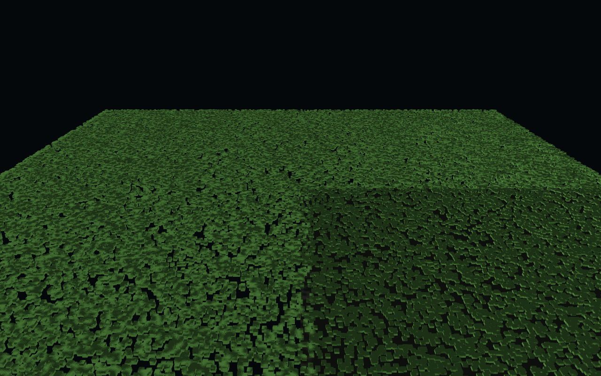

# ae3d


A 3D rendering engine written in [Aether](https://github.com/aether-lang-dev/aether):
one scene API over a switchable **OpenGL 4.1 / Vulkan** backend, a **Blender asset
pipeline**, and an **agent channel** a program — or an AI — drives it through, so a
frame can be checked by number instead of by eye.

ae3d is the continuation of [Gopher3D](https://github.com/nicolas-maman/gopher3D),
the same author's earlier Go engine — rebuilt in Aether and C and taken past where
Gopher3D stopped: a Vulkan renderer at parity with OpenGL and proven pixel by pixel,
screen-space reflections on wet surfaces, and a data-oriented ECS that puts a crowd
of a hundred thousand on screen in a **single draw call**. See [Credits](#credits).

## What it does

- **Two renderers behind one interface.** `Backend` is a vtable of function
  pointers that both the OpenGL and Vulkan renderers fill in, so a program picks
  its renderer with a constructor argument and nothing else changes.
- **OpenGL 4.1 core**, the highest version macOS offers and enough everywhere
  else: PBR materials, up to four directional or point lights, instanced
  rendering, frustum culling, a separate transparent pass, MSAA, FXAA and bloom.
- **Draws are merged automatically.** Identical geometry is uploaded once, and
  models that share it and a material go out as one instanced draw: 400 separate
  models cost 87us a frame in one call, against 1363us in four hundred.
  `core.set_draw_merging(false)` turns it off, which is how those two numbers
  are measured.
- **A crowd is one draw, whatever its size.** A data-oriented entity store
  (`ae3d.ecs`) keeps entities as integer handles and their components in dense
  arrays a system walks in one linear pass; a crowd renders from the position
  column's own buffer as a single instanced draw. Draw calls stay flat as the
  crowd scales — 1k, 10k or 100k entities is one draw on both backends — and a
  million entities advance in ~2.8 ms. `examples/zombie_crowd.ae`.
- **Screen-space reflections** on wet surfaces (Vulkan): a camera-depth prepass
  and a post pass mirror the lit street back onto the road. The composite is
  additive — it only ever adds a reflected highlight, never darkens — and runs
  before the bloom, so the mirrored lamps bloom with the real ones.
- **Shadow mapping** in both backends: the light draws the scene into a depth
  map, and the lit pass compares against it over a 3x3 neighbourhood, offset
  along the surface by the width of one texel rather than pushed into the
  depth -- enough depth bias to stop a grazing wall striping itself is enough
  to lift every shadow off the ground with it. The map is fitted to the scene,
  or to `engine_set_shadow_distance` metres around the camera: a ground plane
  ninety metres across spreads a scene-fitted map until nothing standing on it
  casts anything.
- **Models hang off each other.** A model keeps its own position, rotation and
  scale and composes them onto its parent's, so a figure built from parts bends
  at its joints instead of coming apart. Bounds follow, so culling and picking
  follow a child that moved because something above it did.
- **Fog** belongs to the scene rather than to each model: a colour and the
  distance over which the picture fades into it, applied after tone mapping so
  the colour asked for is the colour that arrives.
- **Vulkan**, windowed and offscreen, on a loader opened at runtime. Nothing
  links against Vulkan, so a program built with this backend still starts where
  no driver exists and says so. It runs the same feature set as OpenGL, and
  `tests/test_backend_parity` proves it: the same scene through both renderers,
  compared channel by channel across materials and textures, instancing and
  transparency, the skybox, FXAA, bloom, shadows, multiple lights, shading
  presets, a Gerstner ocean, back-face culling and an instanced voxel chunk. The
  two agree to within 0.7%
  of channels.
- **Gerstner-wave ocean**, **Perlin terrain**, **voxel worlds** drawn as a single
  instanced call in one of five terrains (plains, mountains, desert, islands,
  caves), **surface nets** over a signed distance field, an OBJ/MTL loader, ray
  casting, and a component system.
- **Scenes save and load.** Transforms and materials as JSON; geometry that came
  from a file records its path, and geometry that did not is written to a
  compressed binary mesh beside the scene. A scene also carries what is attached
  to each model, so a water surface comes back as water with the simulation
  driving it rather than as a mesh with a wave table nothing reads, and it
  records the view it was framed in.
- **Keyframe animation.** Clips, channels and samplers in glTF's shape, with
  step, linear and cubic interpolation, so what Blender exports is what plays.
- **A channel a program can drive.** `AE3D_AGENT=<port>` opens a JSON protocol
  on loopback: read the scene, change it, hold a frame still, read the pixels
  it produced, and ask why a model is not on screen. Costs one load of a global
  per frame when it is not asked for. See [docs/agent.md](docs/agent.md).



*`examples/zombie_crowd.ae`: forty thousand entities, one instanced draw. The
draw-call count does not move with the crowd size.*

## Driving it from a program

An engine started with `AE3D_AGENT` answers questions about itself:

```bash
AE3D_AGENT=7911 ./build/spinning_cube &
python3 tools/ae3d_agent.py --port 7911 trace.model index=0
```

```
ok=True  broke_at=-
  source      n/a  this model was not loaded from a manifest
  asset       n/a  no manifest entry, so there are no exported files to check
  mesh        ok   {"triangles": 12}
  node        ok   {"index": 0, "visible_flag": true}
  animation   ok   {"bound": false}
  visibility  ok   {"in_frustum": true, "on_screen": true}
  pixels      ok   {"coverage": 0.56}
```

`trace.model` follows one model from the Blender object it was authored as to
the pixels it produced and names the first stage where it stopped being right,
which separates half a dozen bugs that otherwise share the symptom "I cannot
see it". The last stage reads the frame rather than reasoning about it.

The same protocol runs inside Blender
(`tools/blender/ae3d_agent_server.py`), so one client drives the modelling tool
and the engine.

## The Blender pipeline

```bash
blender --background scene.blend --python tools/blender/ae3d_export.py -- --out build/assets
```

Geometry, materials and animation per object, with a manifest recording the
source file's hash and a stable id for each object.

The export is deterministic, and Blender is not: regenerating a scene gives the
same vertices in the same order but a different triangulation and polygon
order. The exporter makes its output a function of the geometry instead --
canonical quad diagonals, canonical winding, sorted triangles and sorted vertex
tables -- so two `.blend` files generated separately from the same script
export to identical geometry, animation and materials.

Blender keys with Bezier easing by default; the exporter converts it to cubic
segments the engine samples, and records what Blender itself evaluated the
curve to so `tests/test_assets` can hold the engine to it. It currently agrees
to 1.4e-4.

`examples/blender_pipeline.ae` is the whole path in one program: a turning,
rising orb modelled and keyed in Blender, exported, loaded from its manifest,
and played.

```bash
./scripts/export_assets.sh          # regenerates every asset the repo ships
./build.sh examples/blender_pipeline.ae && ./build/blender_pipeline
```

```
blender_pipeline: showcase.blend exported by Blender 5.2.1 LTS
blender_pipeline: playing 'OrbAction', 1.95833s, 2 channels
```

`examples/zombie_street.ae` is the same pipeline at scale, and it is the scene
the engine is demonstrated and measured with: a night street and a zombie, 49
objects out of one `.blend`, every surface carrying an image authored beside
it. The figure is one skinned surface over a 23-bone skeleton; its bones are
ordinary models, so the clips drive them the way clips drive anything and
`ae3d.ik` solves a limb of them without being told they belong to a skin.

Two scripts hold it to that, both on every build. `scripts/measure_scene.py`
asks what the engine drew. `scripts/critique_scene.py` asks whether it is any
good, which is a different question and one a screenshot cannot answer:

```
critique_scene: the scene meets every standard
  ok   no surface is softer than a texel every four millimetres (607, wanted 256)
  ok   the scene is textured to one standard (607 to 1941 is 3 times, wanted 8)
  ok   every surface holds up at arm's length (0 of 46 below 512)
  ok   nothing large enough to fill a frame is a bare slab
  ok   the figure carries the geometry a figure needs (26272 triangles)
  ok   a planted foot stays planted (worst 0.021 m in a frame, allowed 0.025)
```

`scripts/measure_scene.py` drives a running scene over the agent channel and
says what it found, which is how the picture is checked rather than looked at:

```
opengl, 66 draws, shadows True, fog True, 3 lights
  ok   every model in view traces through to pixels (37 of 40)
  ok   every image a material names was loaded (37 textured materials)
  brick     WallBrick    r=0.344 g=0.234 b=0.192  r/g=1.47  covers 48%
  concrete  WallConcrete r=0.455 g=0.385 b=0.326  r/g=1.18  covers 53%
  skin      ZombieSkin   r=0.329 g=0.296 b=0.179  g/b=1.65  covers 62%
  ok   the same camera draws the same frame (0 pixels of 921600)
  ok   half a millimetre sideways moves almost nothing (0.000% of the frame)
  ok   seeking changes the picture (4.29%), and the hand moves 151 pixels
```

Two faces in one plane are what z-fighting is, so
`tools/blender/check_coplanar.py` reads the exported scene back with the
transforms the manifest recorded and asks whether any pair shares a plane and
overlaps there. `ci.sh` asks it of every exported scene.

Started with `AE3D_AGENT` it can be driven while it runs, which is how the
easing above is checked against the curve rather than against a screenshot:

```
clip        -> OrbAction  1.958s  2 channels
  t=0.0  y=1.500  rot_y=0.000
  t=0.5  y=2.405  rot_y=0.511
  t=1.0  y=3.191  rot_y=0.995
```

## Editor


`editor/` is a scene editor whose chrome is [aether-ui](https://github.com/aether-lang-dev/aether-ui).
It has a scene hierarchy, an asset browser over the meshes in `resources/`, a
console, an inspector that changes with what is selected, and a viewport you
orbit with the mouse and click to select objects in. A transform gizmo moves,
rotates and scales the selection along an axis; edits are undoable; and a
property change repaints the viewport as you drag rather than when you let go.

Objects can be meshes, water, voxel worlds or lights. Each carries a component
recording what it is, and the inspector shows the section that belongs to it:
wave height and speed for water, colour and intensity for a light, field of view
and clip planes for the camera. A behaviour can be attached to any object and
runs in the frame loop.

See [docs/editor.md](docs/editor.md) for the controls.

aether-ui owns the real window and every widget. The viewport is a GPU render:
the scene is drawn into a framebuffer object that has no window of its own, read
back, and blitted into an aether-ui canvas each frame. That is what lets a native
toolkit with no GPU surface host a 3D view
([aether-ui#92](https://github.com/aether-lang-dev/aether-ui/issues/92)); when a
GPU surface exists, the readback is the only part that goes away.

The editor runs on either renderer, `AE3D_EDITOR_BACKEND=vulkan` picks Vulkan
and falls back to OpenGL when no driver is present. Everything the viewport
needs goes through `Backend`, so the two paths differ only in which renderer the
editor constructs.

```bash
git clone https://github.com/aether-lang-dev/aether-ui.git ../aether-ui
./editor/build_editor.sh
./build/ae3d_editor
```

Picking casts the cursor ray against every model's exact triangles, rejecting
each against its bounding sphere first, so selection stays cheap with a full
scene.

## Requirements

- The [Aether toolchain](https://github.com/aether-lang-dev/aether) on `PATH`
  (`ae` and `aetherc`).
- GLFW 3.
- A C compiler.
- The Vulkan **headers**, on every platform. The loader is opened at runtime and
  nothing links against it, but `native/ae3d_vk.c` includes GLFW with
  `GLFW_INCLUDE_VULKAN`, so `vulkan/vulkan.h` has to be present or the build
  stops there.
- For actually running the Vulkan backend: a Vulkan loader and driver. On macOS
  that is MoltenVK. Neither is needed to build.
- `pkg-config`. `build.sh` asks it where GLFW and zlib are; without it the
  fallback is a bare `-lglfw`/`-lz` with no include path, which does not find an
  MSYS2 install.

```bash
brew install glfw                      # macOS
brew install molten-vk vulkan-loader   # macOS, optional, for the Vulkan backend

sudo apt install libglfw3-dev          # Debian and Ubuntu
sudo apt install libvulkan-dev mesa-vulkan-drivers   # optional

# Windows, from an MSYS2 UCRT64 shell
pacman -S mingw-w64-ucrt-x86_64-gcc mingw-w64-ucrt-x86_64-glfw \
          mingw-w64-ucrt-x86_64-zlib mingw-w64-ucrt-x86_64-pkgconf \
          mingw-w64-ucrt-x86_64-vulkan-headers
pacman -S mingw-w64-ucrt-x86_64-vulkan-loader   # optional, to run the Vulkan backend
```

zlib is listed for Windows because the mesh loader includes `zlib.h` directly;
macOS and the Debian toolchains have it already. `vulkan-headers` is not
optional: GLFW is included with `GLFW_INCLUDE_VULKAN`, so the build needs the
header whether or not a driver exists. `pkgconf` is what tells `build.sh` where
GLFW and zlib live.

**Use the UCRT64 shell, and match the Aether install's C runtime.** MSYS2 ships
two environments, UCRT64 linking the Universal CRT and MINGW64 linking msvcrt, and a
`libaether.a` from one does not link against the other. Building ae3d in MINGW64
against a UCRT Aether fails on symbols that look like ae3d's problem and are
not:

```
undefined reference to `__imp__get_timezone'
undefined reference to `__imp__strtof_l'
```

Those are UCRT-only. UCRT64 is the right default: it is what the Aether
installer's own toolchain uses. Either way, build from an MSYS2 shell,
`build.sh` reads `uname -s` to pick the platform libraries, and a plain `cmd` or
PowerShell prompt is not one of the shells it can run in.

## Build and run

```bash
./build.sh examples/spinning_cube.ae
./build/spinning_cube
```

`build.sh` compiles the native layer once, runs `aetherc` over the Aether
sources, and links. `AE3D_FRAMES=<n>` caps any program at `n` frames, so
every example doubles as a smoke test that terminates on its own, and
`AE3D_SNAPSHOT=<path>` writes that last frame out as a PNG:

```sh
AE3D_FRAMES=40 AE3D_SNAPSHOT=/tmp/caustics.png ./build/caustics
```

Running a program proves it does not crash and counting its draws proves it
asked for something. Neither says what came out, and an example that renders
a flat wash of one colour exits zero with the same number of draws as one
that renders the scene it is named after. Looking at the frame is what tells
them apart. Needs the OpenGL backend, which is what every example uses.

`./ci.sh` builds the native layer with warnings as errors, type-checks every
module, runs every test suite, benchmark and example, and checks that every
headless one reports zero leaks. The leak check needs `leaks` to attach to a
stopped process, which some sandboxes deny; `AE3D_SKIP_LEAKS=1 ./ci.sh` runs
everything else.

## Examples

| Example | What it shows |
|---|---|
| `spinning_cube.ae` | The smallest complete program: window, light, one model |
| `backend_switch.ae` | The same scene through either renderer, `./build/backend_switch vulkan` |
| `models.ae` | OBJ loading, including a multi-material model drawn as one group per material |
| `lights.ae` | PBR material presets cycling with the light type, bloom, transparency |
| `water.ae` | A 256x256 Gerstner-wave ocean, 65536 vertices |
| `voxel_world.ae` | 960464 voxels of Perlin terrain, 93030 visible, one draw call |
| `black_hole.ae` | Kerr geodesics integrated per pixel in one screen quad: a spinning hole, its asymmetric shadow, a lensed disc and a lensed sky. The heaviest scene here, and the one with answers to check against. [docs/black-hole.md](docs/black-hole.md) |
| `particle_disc.ae` | The same scene as an N-body: 200000 particles under Verlet integration in one instanced draw, coloured per instance |
| `sand.ae` | 250000 grains falling and settling, click to scatter them |
| `blender_pipeline.ae` | A model authored and keyed in Blender, exported, loaded and played |
| `zombie_street.ae` | A zombie walking a night street and attacking, 40 textured objects from one .blend, wet road reflecting the lamps (Vulkan) |
| `zombie_crowd.ae` | 40,000 ECS zombies shambling in a single instanced draw — the draw-call count does not move with the crowd size |
| `smooth_terrain.ae` | The same terrain meshed with surface nets, 67590 triangles |

### Examples as instruments


The bigger examples are not only scenes. Each is picked to push one part of the
engine harder than anything else does, and to have an answer of its own that can
be checked rather than admired, so that a regression shows up as a number and
not as a picture somebody has to notice.

`black_hole.ae` is the furthest along. It has a benchmark
(`benchmarks/bench_black_hole.ae`) that reports what a frame costs and where,
because a windowed run is pinned to the display's refresh and hides everything
under 6.9 ms; and a test (`tests/test_blackhole.ae`) that measures the shadow
against `sqrt(27) M`, which general relativity fixes and this renderer does not
get a say in. What that has already found in the engine, an emissive surface
that could not carry a colour, a bulk instancing path with no test behind it,
is written up in [docs/black-hole.md](docs/black-hole.md).

## Layout

```
native/     C: GLFW window and input, OpenGL entry points, Vulkan backend,
            float32 mesh and instance buffers, image decoding, the agent
            channel's socket, framebuffer capture
src/ae3d/    Aether modules
  core        vectors, quaternions, matrices, scene types, camera, frustum
  platform    window, input, timing
  shaders     the GLSL programs
  gl          the OpenGL renderer
  vk          the Vulkan renderer
  engine      window, main loop, backend selection
  loader      OBJ/MTL and procedural primitives
  noise       Perlin noise
  voxel       voxel worlds
  water       the ocean surface
  scene       saving and loading scenes
  rendering   presets for the shader's advanced features
  behaviour   game objects and components
  raycast     ray tests against spheres, triangles and meshes
  anim        clips, channels, samplers and playback
  assets      manifests and exported clips, and what a model came from
  agent       the control channel: what a request means
tools/      ae3d_agent.py, a client; agent_schema.ae, the protocol's schema
  blender/    ae3d_export.py, and an agent channel that runs inside Blender
tests/      test suites, each a program that prints its own verdict
benchmarks/ per-frame cost measured without a window
examples/   runnable scenes
  lib/        code shared between an example, its benchmark and its test.
              Not engine surface: a black hole renderer is a tech demo, and
              putting it in src/ae3d would have claimed otherwise
```

## How it is put together

**Aether never handles float32.** A model owns a native mesh handle holding
interleaved position, uv and normal data, and, when instanced, a native buffer of
per-instance matrices. Aether drives them through `ae3d.core`; the GPU reads them
with no conversion pass in between.

**Uniform locations are resolved once per program** into named slots rather than
looked up or hashed per draw. Per-model custom uniforms cache their own location
on the uniform that owns them.

**Only exposed voxels become instances.** A solid world never pays for its own
interior: 960464 solid voxels reduce to 93030 visible ones.

**Bulk paths exist where they matter.** A particle system moving every instance
each frame uploads all positions in one call, not one call per instance.

**The frame allocates nothing.** `benchmarks/bench_frame.ae` runs the heaviest
per-frame work two thousand times with no window, so what it measures is the
engine rather than the GL implementation: 578us to upload two hundred thousand
instance matrices, under a microsecond each for transforms, camera, frustum and
water, and zero leaked bytes at 26MB peak.

**The frame's uniforms go up once, not once per model.** Of the seventeen
uniforms a draw needs, sixteen are the same for every model in the frame. They
are uploaded once per program per frame, which took a four-hundred-model scene
from 1200us to 806us. `benchmarks/bench_scene.ae` keeps that honest.

**The viewport readback is pipelined.** Reading a frame into client memory stalls
until the GPU has finished it; two pixel buffers mean the read is issued into one
while the one filled last frame is mapped, so the CPU never waits. At 1280x720
that is around 1500us a frame against 374us. `benchmarks/bench_readback.ae` measures
both paths in one process. The editor takes the pipelined read and is a frame
behind; anything comparing what it just drew takes the waiting one.

**The editor only redraws when something changed.** A camera move, an edit, a
selection, or a scene holding water or a behaviour. Otherwise the frame already
on screen is the right one, and rendering it again is the largest idle cost an
editor has.

## Differences from Gopher3D

- **One transform, not two.** Gopher3D's `GameObject` carries its own transform
  and the component manager copies it to and from the model's every frame in both
  directions. Here a game object points at the model that already owns one.
- **No voxel chunks.** The instanced path builds a single model for the whole
  world, so chunking bought nothing and cost a pointer chase per voxel. Storage
  is one flat grid.
- **Ray tests return a distance**, negative for a miss, instead of a tuple, so a
  query allocates nothing and the caller derives a hit point only when it wants
  one.
- **Surface nets actually runs.** Gopher3D carries the pieces of a surface
  mesher, corner sampling, edge interpolation and a gradient normal, but its
  surface path only ever emits a height field and the pieces are never reached.
  Here it is the algorithm those pieces describe.
- **Vulkan actually renders.** Gopher3D lists its Vulkan renderer as incomplete.
  Here it is at parity with OpenGL and a test proves it pixel by pixel.
- **No game export.** Gopher3D's editor builds a standalone Go binary. Saving and
  loading a scene covers getting work out of the editor; generating a program is
  a different job from editing one.
- **Ground of its own.** The agent channel, the screen-space reflections and the
  data-oriented ECS crowd renderer are ae3d's, not ported — Gopher3D had none of
  them.

## Credits

ae3d continues [Gopher3D](https://github.com/nicolas-maman/gopher3D) (MIT), the
same author's earlier Go engine. The architecture, the GLSL programs, the material
and lighting model, the OBJ loader's behaviour and the demo scenes carry over from
it; the Go served as the reference, none of it was copied, and the Aether and C
here are an independent implementation that takes the engine past where Gopher3D
left off.

Built with [GLFW](https://www.glfw.org/), [Vulkan](https://www.vulkan.org/) via
MoltenVK on macOS, and [stb_image](https://github.com/nothings/stb).

See [NOTICE](NOTICE) and [THIRD_PARTY_LICENSES.md](THIRD_PARTY_LICENSES.md).

## License

MIT, see [LICENSE](LICENSE).
