# ae3d

[](https://github.com/nicolas-maman/ae3d/actions/workflows/ci.yml)
[](LICENSE)

**A 3D engine built to be driven by programs.** One scene API over Vulkan and
OpenGL, a Blender-to-engine asset pipeline, a scene editor, and a control
channel through which a program, a test or an AI agent builds a scene, reads
back what was drawn and checks the frame by number rather than by eye.

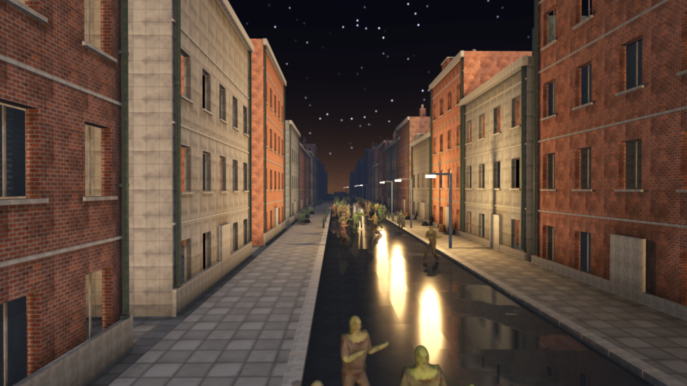

<sub>`examples/zombie_city.ae`: seven blocks and a horde of skinned figures, each walking its own gait from a baked pose bank, two instanced draws per figure; a lamp under every lamp head, the road wet, and on Vulkan every shadow -- the moon's with its penumbra, each lamp's, the occlusion under every foot -- by ray. Every asset was modelled, textured and animated by a script in Blender; the sky was painted by the engine.</sub>

ae3d is written in [Aether](https://github.com/aether-lang-dev/aether) with a
thin C layer for the GPU, windowing and image decoding. It is the successor to
[Gopher3D](https://github.com/nicolas-maman/gopher3D), the same author's Go
engine, rebuilt and taken further: a Vulkan renderer at parity with OpenGL,
skinned instanced crowds, and an engine that can be interrogated while it runs.

## Features

| | |
|---|---|
| **Two renderers, one interface** | Vulkan by default, OpenGL 4.1 at parity; `tests/test_backend_parity` draws the same scene through both and holds them to 0.7% of channels. DirectX 12 and Metal are on the roadmap ([#311](https://github.com/nicolas-maman/ae3d/issues/311), [#312](https://github.com/nicolas-maman/ae3d/issues/312)). |
| **Physically based shading** | Metallic/roughness materials, sixteen lights a frame (the nearest of any number), normal mapping, texel-snapped shadow maps, SSAO, screen-space reflections, ray-traced shadows with penumbrae, every lamp's own shadow and ambient occlusion by ray (Vulkan ray query), MSAA, temporal anti-aliasing, DLSS (NVIDIA Streamline on Vulkan), FXAA, bloom, ACES tone mapping, fog, wet surfaces. |
| **A sky by the hour** | `engine_set_time_of_day(hours)` places the sun and derives the key light, fog and a procedural sky from it. Volumetric clouds from baked Perlin-Worley textures, lit through a sun march, shadowing the ground: ~1.5 ms a frame. |
| **Weather** | Rain, snow, dust and storm over any scene (`ae3d.weather`): a hundred thousand point-instanced particles stepped in C around the camera, wind, the sky and clouds gone overcast, the fog and the sun to match, lightning in a storm. |
| **Water** | A Gerstner sea with dispersion, fresnel, GGX glitter, whitecaps, depth-based shallows and a foam line, and caustics from underneath. |
| **Crowds** | A figure's walk baked into a pose bank; every instance posed in the vertex shader from its own phase, three tiers by distance: the full mesh, a 168-triangle stand-in, and past that an impostor -- a picture baked from the figure's albedo and normals, lit by the scene's lights. The horde's simulation runs over a job pool on every core, and on Vulkan the sort into the tiers is a compute pass drawing through indirect commands, a command per part of the figure. Half a million zombies in a handful of draws at 78 fps, feet planted. |
| **Instancing and ECS** | Instances as matrices or as eight-float points (a million grains of sand in a 32 MB stream); `ae3d.ecs` keeps components in dense columns the crowd systems walk in C. |
| **Voxels and terrain** | Voxel worlds meshed as only the faces that show with baked corner sky; surface nets over a signed distance field for smooth terrain; Perlin heightfields. |
| **Self-painted assets** | Skies, sand, palettes and albedos generated from the engine's own noise and registered as textures. Nothing downloaded. |
| **Models from anywhere** | A glTF 2.0 loader (`ae3d.gltf`): meshes, materials and textures, the node tree, skins with their inverse binds, and every animation as clips, from `.gltf` or `.glb`. A Mixamo figure walks in the engine without passing through Blender, and `gltf.bake_bank` strikes any of its clips into a pose bank, so a figure from a public pack is a horde in one call. |
| **An engine you can ask** | `AE3D_AGENT=port` opens a JSON channel: read and change the scene, hold a frame, read its pixels, trace a model from its Blender object to the pixels it landed on. |
| **An editor** | Hierarchy, inspector, gizmos, terrain sculpting, undo, scene files; one dark theme on every platform. |
| **Input as a game names it** | `ae3d.input`: actions and axes bound once to keys, mouse buttons and a gamepad, read by name from any script (`pressed`, `held`, `axis`), polled by the engine before the scripts run. The camera's own controls are actions in it, so a gamepad flies every example; anything can be injected -- a test, a replay, an agent over the channel (`input.set`). |

The full list, with the reasoning behind each feature, is in
[docs/rendering.md](docs/rendering.md).

## Scenes

| | |
|---|---|
| 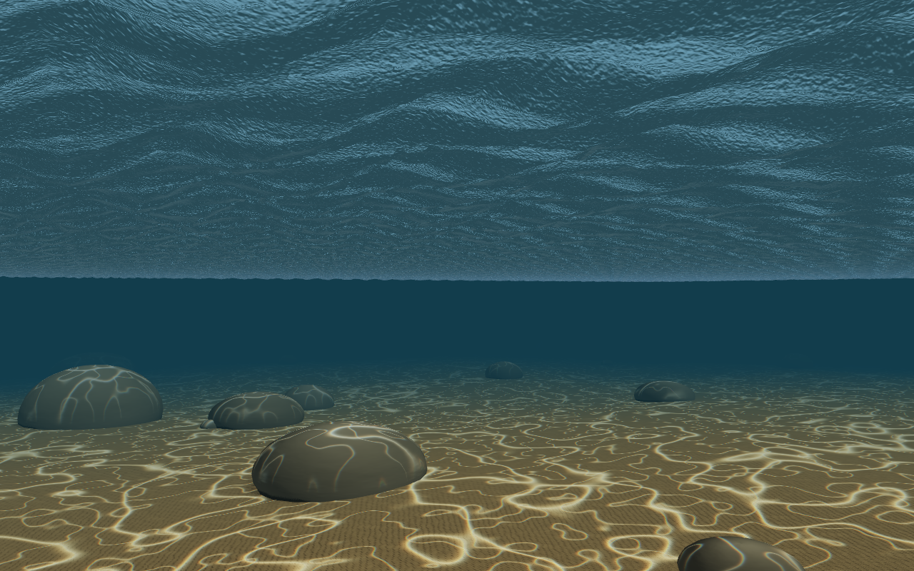 | 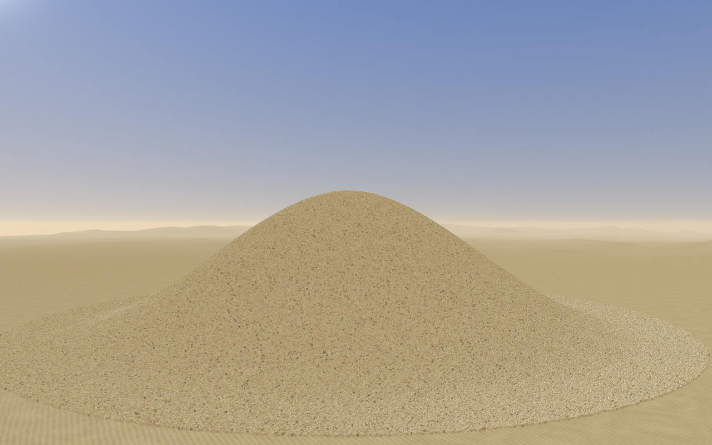 |
| `caustics` — the seabed under the swell, a diver's height off the sand | `sand` — a million grains you plough into a heap that slumps to its angle of repose |
| 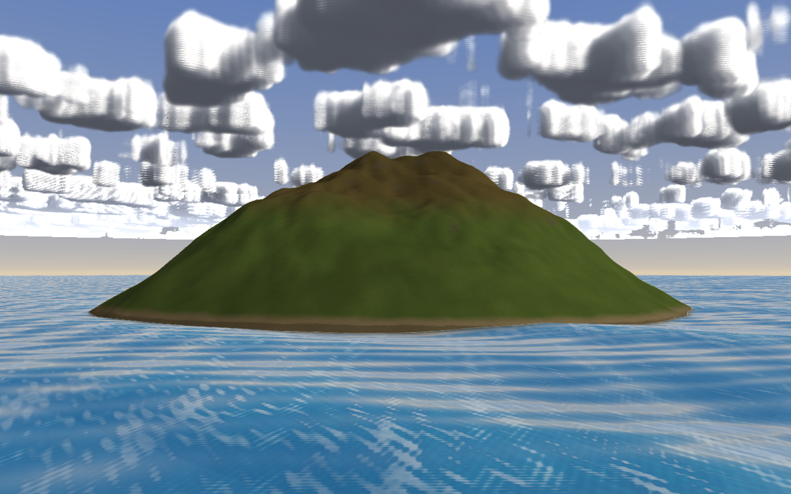 | 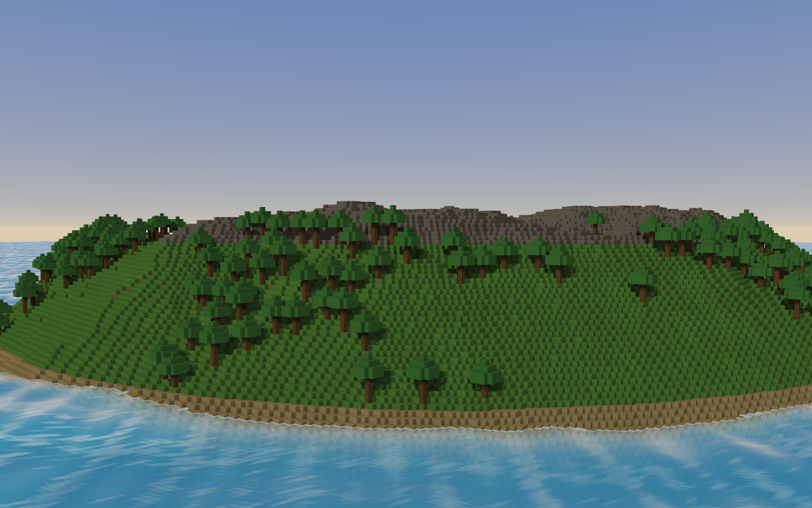 |
| `smooth_terrain` — surface nets over a distance field, albedo baked from slope | `voxel_world` — 3.9 million voxels as 259,000 faces in one draw |
| 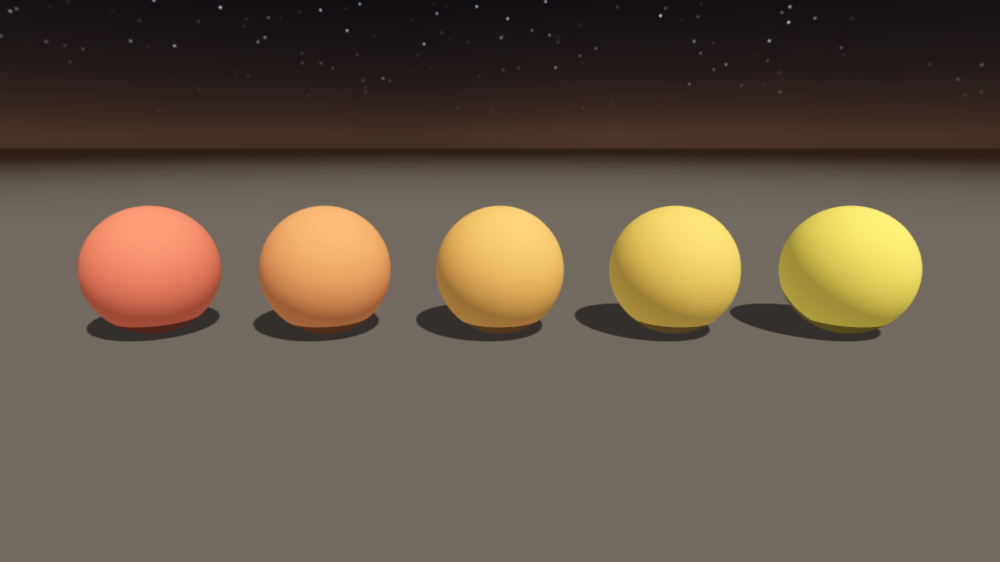 | 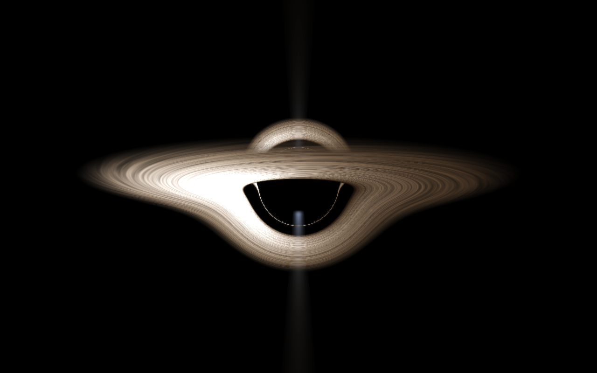 |
| `lights` — the material presets under the painted night | `black_hole` — Kerr geodesics per pixel, the shadow checked against √27 M |

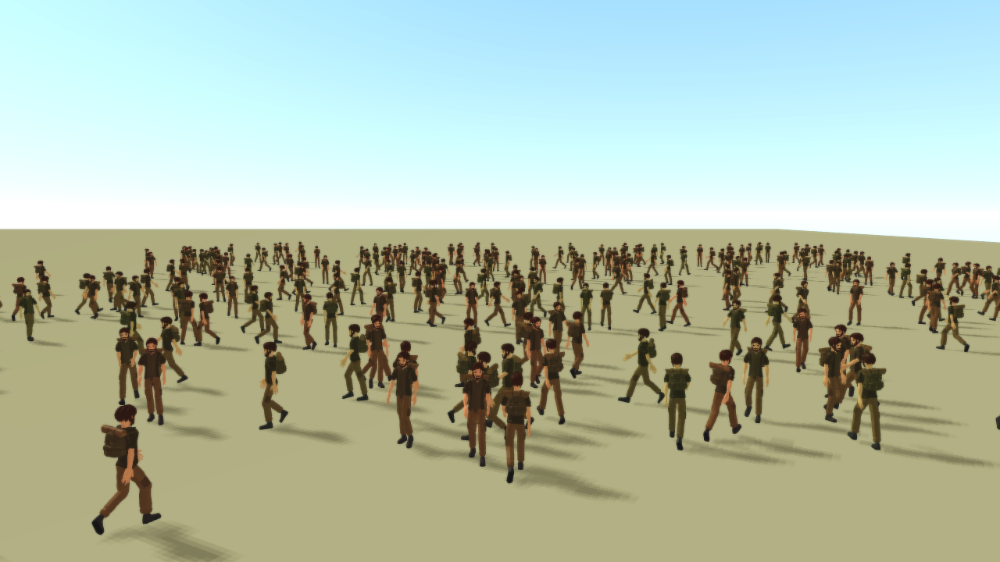

<sub>`AE3D_CROWD=100000 ./build/gltf_crowd adventurer.glb`: a rigged figure from a public Quaternius pack (CC0), its `Walk` baked into a pose bank by `gltf.bake_bank`, a hundred thousand of it sorted on the device into the file's own meshes, the same decimated, and a picture baked by `tools/bake_impostor --gltf` -- fifteen parts a figure, each with its own indirect command, 130 fps hidden, no Blender in the path.</sub>

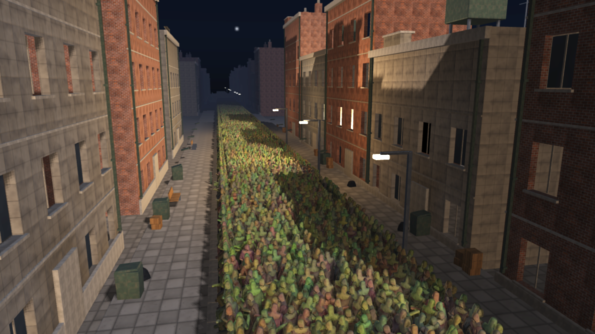

<sub>`AE3D_CROWD=20000 ./build/zombie_city`: the near tier draws the full mesh, the far tier a 168-triangle stand-in, and past eighty metres every zombie is a picture baked from the figure and lit by the scene's lights. The draw count does not change with the crowd, and the simulation runs over every core: ~110 fps at twenty thousand on an RTX 4070 Ti at 1280×720 with the GPU shared, 78 at half a million with the sort on the device and the near band at three metres.</sub>

Every scene is verified the way the engine is: from a sweep of camera
positions and by numbers read back over the channel, not from one still.

## Quick start

Requirements: the [Aether toolchain](https://github.com/aether-lang-dev/aether)
(`ae`, `aetherc`) on `PATH`, a C compiler, GLFW 3, zlib, `pkg-config` and the
Vulkan headers (the loader is opened at runtime; a driver is optional).

```bash
brew install glfw molten-vk vulkan-loader                        # macOS
sudo apt install libglfw3-dev libvulkan-dev mesa-vulkan-drivers  # Debian/Ubuntu
pacman -S mingw-w64-ucrt-x86_64-{gcc,glfw,zlib,pkgconf,vulkan-headers,vulkan-loader}  # Windows, MSYS2 UCRT64
```

```bash
./build.sh examples/spinning_cube.ae && ./build/spinning_cube
./build.sh examples/zombie_city.ae   && ./build/zombie_city
AE3D_API=opengl ./build/zombie_city                               # the other renderer
```

Every program honours a few environment variables:

| Variable | Effect |
|---|---|
| `AE3D_FRAMES=n` | stop after `n` frames, so any example is a smoke test |
| `AE3D_SNAPSHOT=path.png` | write the last frame (`AE3D_SNAPSHOT_BURST=k` for the last `k`) |
| `AE3D_HIDDEN=1` | no window on screen; rendering still happens |
| `AE3D_PERF=1` | print the frame's cost by stage at exit ([docs/performance.md](docs/performance.md)) |
| `AE3D_API=opengl` | run through OpenGL instead of Vulkan |
| `AE3D_RAYS=1` | shadows by ray through the scene's acceleration structure, where the Vulkan device has ray queries ([docs/rendering.md](docs/rendering.md#ray-traced-shadows)) |
| `AE3D_SUN_SIZE=n` | the sun's size for the rays' penumbra, in tenths of a degree (5 is the sun; 0, the default, a point) |
| `AE3D_RAY_AO=1` | ambient occlusion by ray in the screen-space pass's place, with the rays and the occlusion on |
| `AE3D_DLSS=n` | DLSS at mode `n` (1 performance, 2 balanced, 3 quality, 6 DLAA) on Vulkan, with the Streamline runtime beside the program or in `AE3D_STREAMLINE` ([docs/rendering.md](docs/rendering.md#dlss)) |
| `AE3D_RENDER_SCALE=50` | draw the scene at half the window's size, the composite scaling it up |
| `AE3D_AGENT=port` | open the control channel on loopback ([docs/agent.md](docs/agent.md)) |

`./ci.sh` builds with warnings as errors, type-checks every module, runs every
test, benchmark and example, checks the headless ones for leaks, critiques the
demo scene on both backends and holds it to its recorded frame cost.

## Writing a program

A program is written the way a Unity or gopher3D game is: game objects in
the engine's scene, and scripts on them with Unity's phases, by Unity's
names. The engine calls the phases; the program never calls them itself.

```aether
import ae3d.core
import ae3d.engine
import ae3d.behaviour
import ae3d.loader

struct Spinner { pitch: float, yaw: float }        // the script's own state

start(state: ptr, go: *GameObject) {               // once, first frame
    cam = engine.engine_camera(engine.of(go))
    core.camera_look_at(cam, behaviour.object_position(go))
}

update(state: ptr, go: *GameObject, delta: float) { // every frame
    spin = state as *Spinner
    core.model_rotate(behaviour.object_model(go), spin.pitch * delta, spin.yaw * delta, 0.0)
}

main() {
    e = engine.engine_new()
    cube = loader.cube(1.0)
    core.model_set_scale(cube, 20.0, 20.0, 20.0)
    spinner = Spinner { pitch: 18.0, yaw: 30.0 }
    object = engine.object(e, "Cube", cube)             // a game object with a mesh
    engine.script(object, "Spinner", &spinner, start, update)   // AddComponent
    engine.engine_run(e)
    engine.engine_free(e)                               // the scene and its models go with it
}
```

`engine.object` puts a game object in the engine's scene and its model in the
renderer (on the first frame, if the window is not up yet); `engine.script`
puts a script on it. `engine.engine_input(e)` is the input service: bind
`"jump"` to a key and a pad button once, ask `input.pressed(in, "jump")`
from any script. Every phase gets the script's state and the object it
is on, the way a MonoBehaviour has `this` and `gameObject`; the engine is
`engine.of(go)`. The phases each frame, in order: `fixed_update` as many
times as the fixed step fits, `update` once, `late_update` after every
object has updated. `start` runs once, on the first frame the object is in
the scene; `engine.destroy` takes an object out at the end of the frame.
Underneath, the scene is a behaviour (`engine.behaviour_new`,
`engine_add_behaviour`) with the engine handed to every phase, which is what
the engine's own systems -- the weather, the crowd tools -- are written as.

## The pipeline

The zombie street is not a downloaded asset: `tools/blender/make_zombie_street.py`
builds the buildings, the road, the rigged and textured zombie and its walk in
a headless Blender, and `ae3d_export.py` writes a deterministic, manifested
export the engine loads. Every build then runs a critique that holds the scene
to a standard (texel density, normal maps, planted feet, lit windows) and a
frame budget that fails on one extra triangle.

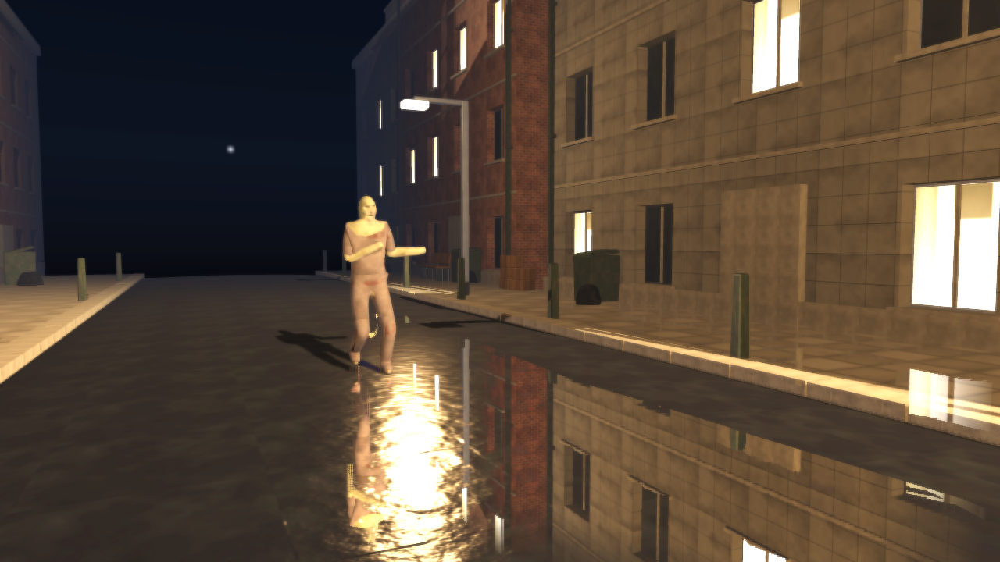

```bash
blender --background --factory-startup --python tools/blender/make_zombie_street.py -- --out resources/blender/zombie_street.blend
./scripts/export_assets.sh resources/blender/zombie_street.blend resources/blender/zombie_street
```

How the export is made reproducible, what the critique measures and how the
agent channel traces a model to its pixels: [docs/pipeline.md](docs/pipeline.md).

## Editor

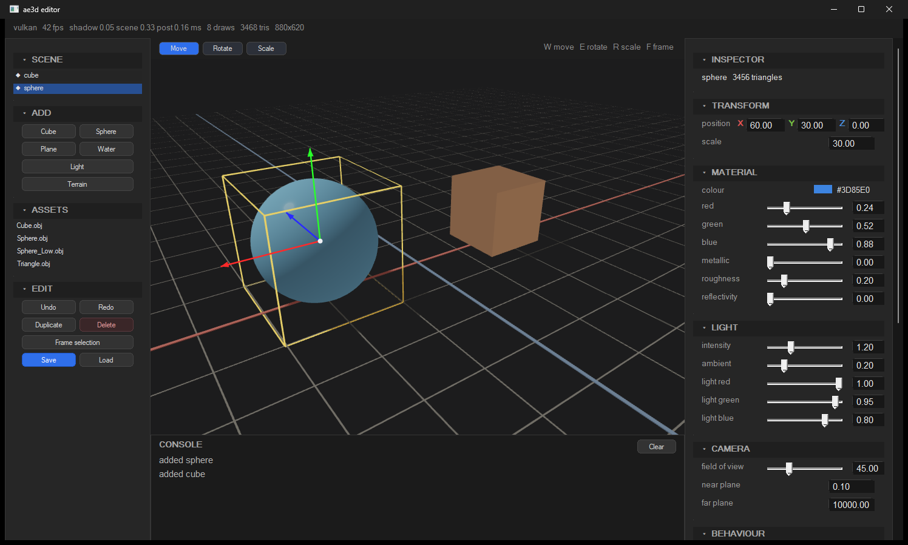

`editor/` is a scene editor whose chrome is
[aether-ui](https://github.com/aether-lang-dev/aether-ui): a hierarchy, an
asset browser, a console, an inspector that changes with the selection, a
viewport you orbit and click in, a transform gizmo, a sculpting brush for
terrain, behaviours attached to objects, and undo. See
[docs/editor.md](docs/editor.md).

```bash
git clone https://github.com/aether-lang-dev/aether-ui.git ../aether-ui
./editor/build_editor.sh && ./build/ae3d_editor
```

## Examples

| Example | What it shows |
|---|---|
| `zombie_city.ae` | The city and its horde; `AE3D_CROWD` sets the count, `AE3D_WEATHER=rain\|storm` puts the weather over it |
| `caustics.ae` | The seabed under the swell, the water's light on the sand |
| `sand.ae` | A million point-instanced grains falling onto a heap you plough |
| `black_hole.ae` | Kerr geodesics per pixel ([docs/black-hole.md](docs/black-hole.md)) |
| `voxel_world.ae` | A voxel island with a forest, under the morning sun |
| `smooth_terrain.ae` | A volcanic island in a sea, an hour before sunset (`AE3D_TIME=HHMM`); `AE3D_WEATHER=rain\|snow\|dust\|storm` over it |
| `models.ae` | OBJ loading, one group per material |
| `lights.ae` | Material presets, light types, bloom, transparency |
| `blender_pipeline.ae` | A model authored and keyed in Blender, exported, loaded and played |
| `gltf_viewer.ae` | Any glTF on a floor under a sun, playing one of its animations: `./build/gltf_viewer Fox.glb Run` |
| `gltf_crowd.ae` | Any glTF figure as a horde: its walk baked into a pose bank, three tiers by distance (its meshes, the same decimated, an impostor baked by `tools/bake_impostor --gltf`): `AE3D_CROWD=100000 ./build/gltf_crowd figure.glb Walk` |
| `backend_switch.ae` | The same scene through either renderer |
| `spinning_cube.ae` | The smallest complete program |

`tools/zombie_street.ae` is the measuring rig the critique and the frame
budget run on: one block, one zombie, held to their standards on every build.

## Roadmap

The engine is built toward an open-world game it has to carry -- hordes of
the real animated zombie, extreme weather, the best picture the hardware
gives, multiplayer -- and the map of what that still needs is
[#326](https://github.com/nicolas-maman/ae3d/issues/326): every line becomes
an issue when it is next, and lands as measured, tested pull requests. Done
on that map: the crowd's sort on the device and its indirect draws, motion
vectors, render scale, DLSS, ray-traced shadows with the crowd in them,
weather. Next: the skinned in the ray-traced scene and occlusion by ray
([#323](https://github.com/nicolas-maman/ae3d/issues/323)), a clustered
lighting path, streaming tiles, physics, navigation, audio, input mapping,
multiplayer; DirectX 12 ([#311](https://github.com/nicolas-maman/ae3d/issues/311))
and Metal ([#312](https://github.com/nicolas-maman/ae3d/issues/312)) beside
Vulkan; the tooling, the scene language and the shaders in Aether
([#272](https://github.com/nicolas-maman/ae3d/issues/272),
[#275](https://github.com/nicolas-maman/ae3d/issues/275),
[#276](https://github.com/nicolas-maman/ae3d/issues/276)).

## Layout

```
native/      C: window and input, OpenGL entry points, the Vulkan backend, mesh and
             instance buffers, pose banks, the crowd step, image decoding, the socket
src/ae3d/    Aether modules: core, gl, vk, shaders, engine, skin, anim, crowd, ecs,
             assets, agent, loader, noise, voxel, water, scene, sky, behaviour, input, ...
editor/      the scene editor
tools/       ae3d_agent.ae (client), ae3d_view.ae (a frame as characters), ae3d_bench.ae (frame budget), measure_scene.ae, bake_impostor.ae, blender/ (the pipeline)
scripts/     export, critique, perf
tests/       one program per suite, each printing its own verdict
benchmarks/  per-frame cost measured without a window
examples/    runnable scenes
docs/        rendering, pipeline, agent, editor, performance
```

## Credits

ae3d continues [Gopher3D](https://github.com/nicolas-maman/gopher3D) (MIT),
the same author's earlier Go engine: the architecture, the GLSL programs, the
material and lighting model and the OBJ loader's behaviour carry over; the Go
served as the reference and none of it was copied. Built with
[GLFW](https://www.glfw.org/), [Vulkan](https://www.vulkan.org/) (MoltenVK on
macOS) and [stb_image](https://github.com/nothings/stb); see [NOTICE](NOTICE)
and [THIRD_PARTY_LICENSES.md](THIRD_PARTY_LICENSES.md).

## License

MIT, see [LICENSE](LICENSE).
