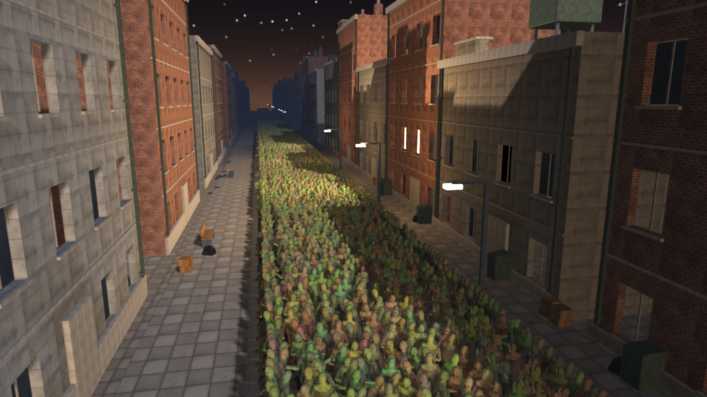

# Crowds and navigation

How the engine carries a horde: a figure's walk baked once into a pose
bank, its instances kept in dense columns rather than objects, the
simulation's passes run over the job pool, the flow field the horde
follows, and the tiers the renderer sorts it into. The draw side -- the
pose bank sampled in the vertex shader, the impostors, the sort on the
device, the indirect draws -- is in [rendering.md](rendering.md); this page
is the simulation.



## The entity store

`ae3d.ecs` is the other shape a scene can take. A game object is a heap
block and a vtable of phases, the right shape for a handful of scripted
things and the wrong one for a million: an allocation and a virtual call
per entity per frame, and no two entities' data adjacent. In the ECS an
entity is an integer handle (a slot and a generation, so a handle kept
past its entity's death fails `entity_alive` instead of reading a
stranger's data), and component data lives in dense preallocated columns
a system walks front to back. Nothing is allocated per entity after the
world is built. Twenty-four index bits hold 16.7 million live entities.

## The pose bank

A skinned draw is posed by one bone palette. A crowd cannot be: a thousand
figures at a thousand points in the walk would be a thousand palettes.
`crowd.posebank_bake` samples a clip into a bank of `frames` poses, each a
full palette at one time in the clip; every instance carries a phase and
is posed in the vertex shader from the frame its phase picks. The bank is
fixed at `frames` poses however large the crowd grows, which is what lets
an animated crowd scale the way a static one does. `posebank_travel` and
`posebank_speed` say how far the clip's root moves in a cycle, so a
figure's feet plant: the step each frame is the bank's pace, not a number
chosen to look right. `gltf.bake_bank` strikes any glTF clip into a bank,
so a figure from a public pack is a horde in one call (`examples/gltf_crowd.ae`).

## The horde's passes

`ae3d.horde` is the crowd's simulation, in Aether over the columns and the
engine's pool. Each pass is the same few lines on every figure with nothing
shared but the arrays, run in blocks of a few thousand (`horde.GRAIN`):

- **The separation.** Pushing a crowd apart is the one super-linear pass:
  every figure against the neighbours in the nine cells around it, tens
  of millions of tests a frame at half a million. A counting sort packs
  the positions themselves cell by cell (a per-cell offset table over
  packed arrays), so the neighbour scan walks a cell's figures as one
  contiguous run; the only scattered access left is one write of the
  accumulated push to each figure's velocity. A cell keeps at most
  `per_cell` figures, so a jammed cell costs a bounded number of tests
  and the few not pushed this frame are a different few next frame.
- **The wander** (a heading drifted by noise) and **the step** (a figure
  along its heading at the bank's pace, its phase advanced).
- **The tiers**: the sort by distance from the camera into the full mesh,
  the stand-in and the impostor, over fixed runs (`jobs.parallel_for_fixed`)
  so every worker writes its own stretch of the compacted buffers and the
  order is the order one thread would have written.
- **The audit**: every figure against its last position, so a figure
  that teleported is a failed test and not a frame someone has to notice.

The trigonometry is approximate on purpose -- a facing needs to be right
to a degree, not to a bit -- and several times cheaper than libm's at
half a million a frame. Measured against the C it replaced, in the same
run on the same 24-thread machine: the separation of half a million on
one thread 51.4 ms against 51.5; the city's 200,000 over the pool
separate in 5.5 ms against 5.45, step in 0.92 against 0.80, wander in
0.18 against 0.26. With the sort on the device the whole simulation of
half a million is 8 ms of a frame at 79 fps ([performance.md](performance.md)).

`ae3d.crowd` wraps the passes for a scene (`crowd_wander`, `crowd_step`,
`crowd_tiers`, `crowd_audit`, `horde_separate` over a `CrowdGrid`) and
owns the device crowd (`device_crowd_new`, `device_crowd_update`), the
buffer the compute sort reads.

## Navigation

A path per zombie is a search per zombie; a hundred thousand of them want
one search. `ae3d.nav` is a flow field over the ground:

```aether
field = nav.flow_new(x0, z0, x1, z1, 1.0)          // the ground, metres, a cell a metre
nav.flow_block_model(field, building)               // what nothing walks through
nav.flow_build(field, core.vec3(px, 0.0, pz))       // the target: the player
nav.flow_steer(field, positions, yaws, count, 2.0 * delta)   // every heading toward it
```

The field is the cost from every cell to the target, found by one flood
from the target outward over the cells nothing stands in: a Dijkstra
eight ways, a straight step 10 and a diagonal 14 (tenths of a cell, as
integers, so the frontier is a ring and not a heap), no diagonal past a
blocked corner so nothing is told to walk through the edge of a wall, and
a direction per cell toward the cheapest neighbour. A figure reads the
direction under its feet and turns toward it by at most `turn` a step, so
the horde swings round rather than snapping; where the field says nothing
it keeps its heading and the wander and separation carry on.

The flood is paid once each time the target crosses a cell: 8.2 ms for
the city's field against the C's 8.3 (the marks as ints; as bytes read
through `std.mem` the flood took twice as long, a runtime call a read).
The steer runs over the pool: 1.7 ms for 200,000 figures on one thread.
A cell points one of eight ways, so the heading it asks for is one of
eight constants, not libm's `atan2`, which isn't the same function on
every platform: a horde stepped on every peer of a game
([networking.md](networking.md#the-horde)) turns by the same bits on each.
`AE3D_HUNT=1` sends the city's horde after the camera with it.

## What is checked

`tests/test_horde` starts a crowd in a wide ring and checks its mean
distance to the target collapses (a horde moves as one); `test_horde_separate`
starts 1,500 figures on one spot and checks the crowd's spread grows as they
shove apart; `test_horde_scale` runs the whole update over half a million
and fails if a step blows past real time; `test_nav` floods a field and
checks the directions and the headings turned by them; `test_posebank`
checks each baked frame against the skeleton driven live to the same
time; `test_crowd_ecs` and `test_ecs*` the store; `test_device_crowd` the
device sort against the CPU's; `test_jobs` the pool's pass and block
counts at one thread and many; `test_net_horde` a horde stepped alone and
over four threads, compared bit for bit. Every pass but one gives the same
bits at any thread count: the separation with no pool visits each pair once
and pushes both, the same pushes added in another order than the pool's
gather, so its velocities can differ in their last bits (1,773 of the 4,500
velocity components of a knot of 1,500). `horde.separate_exact` gathers alone too, at twice the pair tests, and
is what a networked horde steps by. The tests run at one thread and many.
