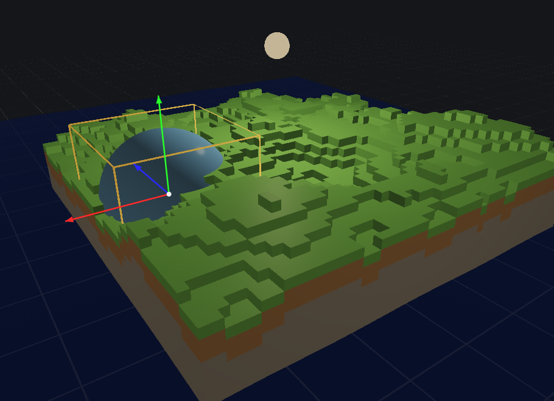

# The editor

```bash
git clone https://github.com/aether-lang-dev/aether-ui.git ../aether-ui
./editor/build_editor.sh
./build/ae3d_editor                         # the scene it last saved
./build/ae3d_editor build/street.json       # a scene file
AE3D_SCENE_OUT=build/street.json ./build/street_drive   # any program writes one
```


The chrome is one dark theme on every platform: neutral greys, three tones
apart -- the viewport's ground, the panels a step lighter, the bars and
fields a step darker -- with one accent for the primary action and the
selected row, the way Unity's, Blender's and Unreal's dark themes are
built. It is a style sheet in `editor.ae` (`theme()`), so there is one
place the colours live. On Windows the toolkit paints every widget on the
ground behind it and scrolls the panels; the inspector's sections past the
window's bottom are reached with the wheel or the bar.

## Controls

The viewport has to have focus for a key to reach it, so click in it first.

| | |
|---|---|
| drag | orbit the camera |
| scroll | zoom |
| click | select the object under the cursor |
| drag a gizmo axis | move, rotate or scale the selection along it |
| `W` | translate gizmo |
| `E` | rotate gizmo |
| `R` | scale gizmo |
| `F` | frame the selection |
| `D` | duplicate the selection |
| `Z` | undo |
| `Shift` `Z` | redo |
| `Delete` or `Backspace` | delete the selection |

Picking casts the cursor ray against a model's exact triangles, rejecting each
against its bounding sphere first, so selection stays cheap with a full scene.

## Panels

**Scene** is the hierarchy: a tree of the scene's objects, roots in scene
order, an object's children under it behind a disclosure, closed until
opened -- the street of `examples/street_drive.ae` opens as its five
blocks, its car, its crate walls and its bystanders, ten rows for 1,212
models, and expands where you look. A parent is any object another's
model is parented to; a **group** is an object with a transform and
nothing to draw (`engine.object(e, "Block 3", null)`), the way a program
folders what it builds, and the scene file carries the parents. The
filter box above the tree narrows it to the objects whose names have the
text, flat, as every editor's outliner searches. A click selects one
object; holding shift or command adds to the selection; selecting an
object under a closed parent opens the way to it. Delete takes an object
out with everything under it, Duplicate copies the subtree with its
parents kept. The inspector shows the last object clicked and an edit
reaches everything selected, so typing a height with three objects
selected puts all three at that height. The grid and the selection
outlines are the editor's own geometry: the renderer draws them, but
they are not objects and do not appear here.

**Add** creates a cube, sphere, plane, water surface, light or terrain.

One terrain, not five. Which shape a terrain takes is a property of the terrain,
chosen in its own inspector section and changed there afterwards, the way a
landscape works in Unreal and in Unity. The panel's job is to say that a terrain
is a thing a scene can have; knowing what a desert looks like is
`src/ae3d/terrain`, a module rather than editor code, so what each shape
produces is measured without a window in `tests/test_terrain.ae`: hills have
more relief than plains, a desert is smoother than both, and caves are the only
one with rock over open space.

A terrain is drawn as **blocks** or as a **smooth** surface. Blocks are a cube
per filled cell; smooth meshes the same field into one surface. Voxels are one
way of meshing a terrain rather than what a terrain is, and both come from the
same world, the same seed and the same five shapes.

**Sculpting.** Under the style is the brush: Off, Raise, Lower and Smooth
out, and its reach in metres. With the brush on, a press on the selected
terrain moves the ground under the cursor and a drag keeps moving it, once
per cell the cursor crosses -- the brush is a rate of change of the ground,
so a slow drag is not a deeper one. Raise and Lower move each column within
reach by up to two cells at the centre, falling off to nothing at the edge;
Smooth out pulls each toward the mean of its neighbours. A raised column
grows in the kind its top was, so grass stays grass and sand stays sand, and
a lowered one uncovers what was under it. The terrain is rebuilt after every
touch, blocks or smooth. A stroke, press to release, is one undo step, whose
before and after are the terrain's column heights. Changing the shape, the
seed or the style fills the world again from its seed, which is to say it
discards the sculpting; undo brings it back.

Changing the shape, the seed or the style fills the same world again and gives
the model that is already there its new geometry, so the object keeps its place
in the scene and its place in the undo history. The renderers decide a model's
buffers when it is added, so the model leaves the backend and comes back around
the change; `core.model_set_mesh` and `core.model_disable_instancing` say so
where they are defined.

**Assets** lists the meshes under `resources/obj`. Clicking one loads it into the
scene and frames it.

**Behaviour** attaches a script to the selected object. A script is an ordinary
Aether source file in `resources/scripts`, with Unity's phases by Unity's
names and the engine's signatures -- the functions a program hands to
`engine.script`, so one script shape serves the editor and a game:

```aether
import ae3d.core
import ae3d.behaviour

exports (update)

update(state: ptr, go: *GameObject, delta: float) {
    core.model_rotate(behaviour.object_model(go), 0.0, delta * 60.0, 0.0)
}
```

The editor hands a null `state` (a script keeps its own in its globals) and
the game object the script is on; every row of the hierarchy is a
`GameObject` in the editor's scene, its model the object's, and
`engine.of(go)` is the editor's engine -- the camera, the light, the weather
-- as it would be in a program.

`scripts/build_script.sh resources/scripts/spin.ae` compiles it into a shared
library beside the editor, and the editor opens what it finds: the buttons in
the section are the files in that directory, so adding a behaviour is adding a
file and the editor does not have to be taught what it does. A script may also
export `start`, which runs once when it is attached.

**New script** writes a template into `resources/scripts` and says where it
went. Building it is the same step that builds every other script, and the
editor picks the library up when it appears.

A script rebuilt while the editor is open is reopened without restarting it,
and starts again on everything carrying it. The editor compiles nothing: it
watches the library rather than the source, so a source saved with an error in
it leaves the last good behaviour running until the build succeeds.

The scene records the script by name, so a project that still has the file gets
the assignment back when it loads. A scene naming a script the project does not
have gets none rather than a wrong one.

A script links the same engine library the editor links,
`build/libae3d_native`, so a call into the engine reaches the one copy the
editor is running rather than a second copy with an empty GL loader in it. The
three platforms each offered a different way to arrange that, and two of them
would have let a script carry its own engine; this is the arrangement that is
the same everywhere.

CRITICAL: build a script with the tree that will run it. A script carries its
own copy of the Aether it imported, so it and the editor agree about what a
`Model` is only while both were built from the same sources.

**Edit** is undo, redo, duplicate, frame, delete, and saving or loading the
scene. The file is the one the editor was opened on -- its argument, or
`AE3D_SCENE` -- and `build/editor_scene.json` otherwise; meshes that came
from no file are written beside it, in a directory named after it. Loading
replaces the scene rather than merging into it, and clears the history,
since the steps in it refer to models that are gone.

**Simulate** (also File, Cmd+P) runs the scene's bodies: `ae3d.physics` is
attached to the editor's engine, every object with a body gets one from
its record (see the physics section below), and the frame steps the world
the way a program's loop does, so crates fall, cars roll off kerbs and
towers topple in the viewport. Pressed again it stops, the world goes, and
every model is put back exactly where it stood: the simulation is for
looking at, and what it did to the scene is not kept. Loading a scene
while one runs stops it first.

**Console** keeps the last few messages. The status line under the viewport
carries the newest, and the stats bar beside it says what the last frame
cost: the rate, then the device's own time for each pass -- the shadow map,
the scene, the effects -- in milliseconds, then draws, triangles and the
size. A rate says a scene is slow; the split says which pass made it so.

**Inspector** changes with what is selected. Transform, material and
physics are always there (colour, metallic, roughness, and reflectivity --
how much of the wet road's mirror a surface gets on Vulkan, under
Reflections); water, light, camera, behaviour and rendering sections
appear when they apply.

The physics section is the body an object is, as the scene file records
one and `ae3d.physics` reads it back: four buttons for the kind -- None,
Static, Kinematic, Dynamic -- and five for the collider, which is made
from the object's own mesh: Box (its bounds), Sphere and Capsule (of them),
Hull (the convex hull of its vertices, what a prop wants) and Mesh (its
triangles, for the static world -- a building, a kerb). Under them, three
rows: the surface's friction and bounce, and the density the collider
weighs. A kind is one undo step, as the weather's is; the rows undo like
any row. The record is a component of the object (`mesh · dynamic body`
under its name), so it is duplicated, deleted and undone with it, and the
scene file carries it as the model's `physics` record -- the same record a
program's scene writes (`AE3D_SCENE_OUT`), so a scene built by a program
opens here with its bodies and one built here loads into a program with
them. A section is the rows that belong to it rather than a run of them: the
water rows are not contiguous, because the foam, wave scale and shore rows
were added after the row indices below them were spoken for, so which section
a row is in is a question asked of the row and not of its number. The water
section is the whole simulation: amplitude, speed, opacity, foam, the wave
scale (how many times longer than the table's kilometre swells the waves
are), and the shore -- the metres of water the bottom shows through and the
metres the foam line runs out over. Rendering has the fog switch with
its two rows, where the fog starts and where it is whole in metres (its
colour is the sky's), the clouds switch and,
under it, the cover: how much of the sky they take, a slider like any row,
undone like one, and saved with the scene, and the overcast, 0 to 1, that
pulls the sky toward a flat grey; the sky section has, under its
three colour channels, a **Sun by time** switch and the hour: on, the key
light takes the sun's direction, colour, strength and fill for that hour
and the sky is drawn from the same sun, so a scene can be dragged from noon
to dusk to night and back, and the scene file carries the hour; and the
ambient occlusion switch
with its two rows, how dark the occlusion goes and how far in metres a thing
shadows what stands beside it. Occlusion is the view's, not a model's: it is
drawn from the scene's depth over everything opaque, by either backend.

The weather section is the engine's weather module over the viewport:
five buttons for the kind -- Clear, Rain, Snow, Dust, Storm -- lit like the
gizmo's modes, and three rows: the strength, 0 to 1, the wind's heading in
degrees (from +X toward +Z) and its speed in metres a second. A kind
brings what it brings in a game -- its particles falling around the
camera, its fog, its cloud cover and overcast, a dimmed sun, a storm's
lightning -- and Clear gives the scene's own sky back, the clouds and the
overcast the rows above hold. While there is weather the sky is the
weather's, so the clouds and overcast rows wait until it clears; the light
rows still act, and the weather dims from whatever they set. The kind is
one undo step, the rows undo like any row, and the scene file carries all
of it (`weather`: the kind by name, the strength, the wind). Underneath,
the editor holds an `engine.engine_over` -- an Engine wrapped around the
viewport's renderer, camera and light, with no window or loop of its own,
stepped by the frame with `engine_update` -- so what is written for the
engine runs in the editor unchanged.

## Undo

An adjustment is one step, not one step per event: dragging a slider from 0 to 34
records a single step spanning the whole move, so undo steps back the adjustment
rather than a pixel of it. Adding and deleting are undoable too, which means a
deleted object stays alive as long as the step that removed it.

The history is `src/ae3d/history`, a module rather than editor code, so it is
tested without a window: `tests/test_history.ae`.

## Behaviours

Spin, bob and orbit can be attached to any object and run in the frame loop.
Gopher3D compiles and hot-reloads Go scripts; these are built in, because the
part that matters in an editor is attaching a behaviour and watching it run.

Bob moves by the derivative of its own curve rather than to an absolute height,
so it needs no memory of where the object started and still works after the
object is dragged somewhere else.

## What a scene keeps

Saving writes more than the models. Each model records what is attached to it,
which is how a water surface comes back as water rather than as a mesh with a
wave table nothing reads:

| | |
|---|---|
| component | `water`, `voxel`, `light` or `mesh` |
| script | the behaviour running on it, if any |
| physics | the body it is (`static`, `kinematic`, `dynamic`), its collider from its own mesh (`box`, `sphere`, `capsule`, `hull`, `mesh`), the surface's `friction` and `restitution`, and the `density` |
| water | every knob of the simulation driving it, the wave scale, the shore and the sky image it reflects included |
| material | colour, metallic, roughness, reflectivity, alpha, and the texture and normal map paths |
| rendering | FXAA, bloom, reflections (SSR), clouds and their cover, the overcast, ambient occlusion with its strength and reach -- the view menu's switches, applied on the backend that has them |
| weather | the kind by name (`clear`, `rain`, `snow`, `dust`, `storm`), its strength, the wind's heading in degrees and its speed |

and the file records the view: where the camera stood, its field of view and
clip planes, whether face and frustum culling were on, the reflections'
road height and strength, and the fog -- whether, where it starts and is
whole, and its colour, the sky's. Each model names its `parent` by index,
and a `group` is a model with no mesh: a transform its children are
placed by. A system's own models -- a ragdoll's bone capsules -- are not
in the file at all; the program makes them again.

A voxel world is written as what it takes to fill one again, its size and its
seed and its terrain, rather than as its grid: six numbers reproduce it exactly,
where the grid they replace is a megabyte and a half. What a hand did to it
afterwards is written beside them as `columns`: every column whose height is
not what the seed makes, as x, z and height, which is a few numbers for a
stroke of the brush and nothing at all for a world nobody touched. Loading
fills the world from its seed and then sets those columns.

`AE3D_EDITOR_SCENE=roundtrip` builds the component scene, saves it and opens it
again before the run starts, so the report describes what came back rather than
what was built. CI asserts the same component counts for it as for the scene
built directly, which is what catches a component the file does not carry.

A scene written by a program is the same file. `AE3D_SCENE_OUT=path` makes
any program write its scene on its first frame -- once every script has
started and built its objects, before anything moves -- with every model
the renderer draws, the lights, the view as the program set it (the
camera, the sky's hour, the post chain, the occlusion) and the body on
every object that has one, which `ae3d.physics` answers through the
engine's attachment providers. `./build/ae3d_editor path` opens it: the
street of `examples/street_drive.ae` is 1,347 models and 299 bodies, and
opens in a few seconds, since a source file shared by many entries is read
once and copied. The agent channel's `scene.save` writes the same file
from a running program.

## Running it bounded

The editor takes a few environment variables, which is how CI drives it.
The Linux job fetches aether-ui at the commit `.github/workflows/ci.yml`
pins (`AETHER_UI_REF`) and GTK4, builds the editor against it, runs it
bounded on both backends and the roundtrip scene, and presses its
widgets through `tools/drive_editor.ae`; the other runners have no
toolkit checkout and skip it, and so does a machine without one.

| | |
|---|---|
| `AE3D_EDITOR_FRAMES=n` | stop after `n` frames and exit |
| `AE3D_EDITOR_SNAPSHOT=path` | write the viewport to a PNG on the last frame |
| `AE3D_EDITOR_REPORT=path` | write what the editor built to a text file |
| `AE3D_EDITOR_SCENE=components` | start with water, voxels, a light and a behaviour |
| `AE3D_EDITOR_SCENE=roundtrip` | the same, saved and loaded again before the run |
| `AE3D_SCENE=path` | open this scene file (or pass it as the argument); Save writes it back |
| `AE3D_EDITOR_DRIVER=1` | serve the widget tree on `127.0.0.1:9222` |
| `AE3D_EDITOR_BACKEND=opengl` | use the OpenGL renderer; Vulkan is the default where a driver exists |

The driver is how the layout is checked without being able to see it. aether-ui
cannot rasterize widgets to pixels, so `GET /widgets` and its geometry is the
only way to tell whether a panel is where it should be.

## How the viewport works



aether-ui hosts a real GL context
([aether-ui#92](https://github.com/aether-lang-dev/aether-ui/issues/92)), so the
scene is drawn straight into it. The viewport is two layers: the GPU view
underneath, and a canvas over it carrying the gizmo. The canvas keeps every
event it ever had, so orbiting, picking and dragging are unchanged; what it no
longer carries is a copy of the scene.

That is worth more than the readback it saves. A canvas can only ever hold the
canvas's own point size, so the blit path rendered the scene at 880x622 on a
display whose viewport is 1760x1244 pixels and let the window scale it up. The
GPU view is given the framebuffer size, so the picture is the screen's.

Two sizes follow from that, and mixing them is a bug the compiler cannot catch:
the renderer and the camera work in the framebuffer's pixels, and the gizmo is
drawn and picked in the canvas's points.

Where there is no GPU surface to draw on, the scene is drawn into a framebuffer
of its own, read back and blitted into that same canvas, which is what every
run did before and what a Vulkan run still does: Vulkan cannot draw into a GL
context. `ci.sh` reads `viewport_path` out of the editor's report and fails an
OpenGL run on macOS that took the blit, because falling back is invisible in a
picture. It checks the snapshot's size against the size the scene was rendered
at for the same reason.

The one thing the GPU path does not carry is the gizmo in a snapshot: a
snapshot is the frame the renderer produced, and the gizmo is on the canvas
above it.
