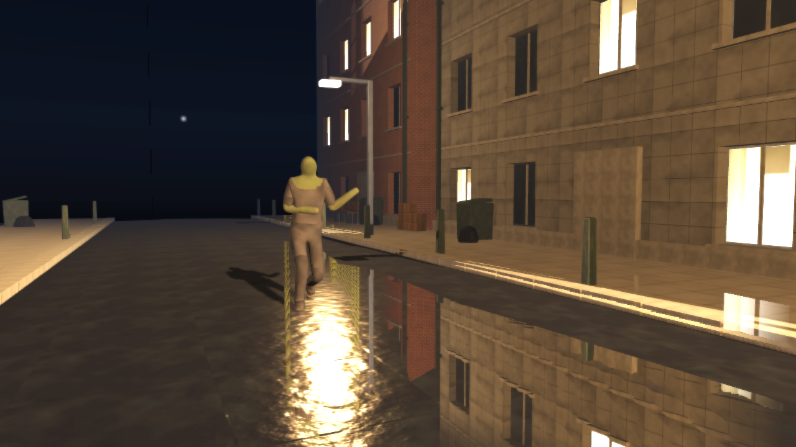
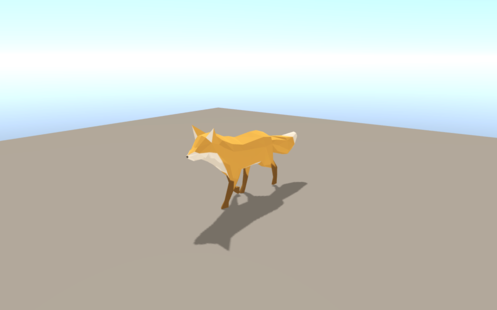

# The asset pipeline and the agent channel

How a scene gets from a Blender script to the frame, how every build holds it to a standard, and how a program drives the running engine. The [README](../README.md) is the short form; the protocol itself is in [agent.md](agent.md).

## The Blender pipeline

The zombie street is not a downloaded asset. `tools/blender/make_zombie_street.py`
builds the whole scene in a headless Blender: the terrace of buildings, the
street furniture, the road with its camber, the zombie as a skin-modifier
body over a 24-bone rig with a sculpted face, its clothes, the textures (generated with numpy,
brick and paving and dead skin and cloth, each with a normal map), and the
walk cycle, lunge and recovery as a footstep plan solved onto the legs.
`ae3d_export.py` then writes each object's geometry, material, animation and
occlusion beside a manifest the engine loads.

```bash
blender --background --factory-startup --python tools/blender/make_zombie_street.py -- --out resources/blender/zombie_street.blend
./scripts/export_assets.sh resources/blender/zombie_street.blend resources/blender/zombie_street
```



*`tools/zombie_street.ae`: the same export as one figure, the rig the
engine is measured on. 225 objects, every surface textured to one texel
density, the figure one skinned surface with a face, and the wet road taking
the lamp.*


*The same rig through Vulkan, where the wet road is a screen-space reflection
of what is drawn: the windows, the lamp and the figure, mirrored. The march has
a thickness, so a figure reflects as a figure and not as a stripe; the critique
measures that the rows under its feet hold the feet mirrored, not the torso
smeared.*

What makes the pipeline usable by a program rather than a person:

- **The export is deterministic.** Blender is not: regenerating a scene gives
  a different triangulation and polygon order. The exporter makes its output a
  function of the geometry (canonical diagonals and winding, sorted triangles
  and vertex tables), so two `.blend` files built from the same script export
  byte-identical assets.
- **The build says what the animation is.** Timeline markers (`gait`,
  `gait_end`, `lunge`, `recover`) go into the manifest, and a scene asks for
  them by name: the crowd loops exactly one gait cycle, which repeats without a
  seam, instead of hard-coding a frame range.
- **The engine paints its own skies and ground.** `tools/make_sky.ae` writes
  the desert's afternoon sky, the city's night sky (moon, stars, the town's
  glow at the horizon) and a tiling sand texture from the engine's own noise
  through its own PNG writer -- no downloads, no second language.
- **Textures can be looked at without Blender.**
  `py tools/blender/preview_textures.py brick out/brick.png` renders any
  generator to a PNG (within ~2% of what Blender exports), so a texture is
  tuned by looking at it and a change is verified rather than trusted.
- **Bezier easing is preserved and checked.** The exporter converts Blender's
  curves to cubic segments and records what Blender evaluated them to;
  `tests/test_assets` holds the engine to it (currently within 1.4e-4).
- **Coplanar faces are caught at export.** `tools/blender/check_coplanar.py`
  reads the exported scene back with its transforms and reports any pair of
  faces sharing a plane, which is what z-fighting is; `ci.sh` runs it on every
  exported scene.

- **The crowd's pictures are baked by the engine.** `./build/bake_impostor
  <manifest> <figure>` draws the figure the way the crowd draws it -- its
  gait baked in place, one instance at the origin -- from eight angles by
  eight frames of its walk, and writes `impostor_<figure>.png` (its
  albedo), `impostor_<figure>_normal.png` (its normals) and a `.json` with
  the grid and the metres a cell spans, beside the export. `zombie_city`
  draws every zombie past `AE3D_IMPOSTOR` metres from them; `ci.sh` rebakes
  one on every build and holds it to every cell filled. A change to the
  figure or its walk in Blender is a re-export and a rebake, both scripts.

### Holding the scene to a standard

Two programs run on every build. `tools/measure_scene.ae` asks the engine
what it drew; `tools/critique_scene.ae` asks whether it is any good, which a
screenshot cannot answer:

```
critique_scene: the scene meets every standard
  ok   no surface is softer than a texel every four millimetres (607, wanted 256)
  ok   every surface big enough to stand next to has a normal map (0 without)
  ok   the figure carries the geometry a figure needs (27408 triangles, wanted 20000)
  ok   the street has its lamps and windows alight (88 cells over 0.55, wanted 3)
  ok   and lit in pools rather than flooded flat (7% of the frame burns that bright)
  ok   no foot sinks through the road (the lowest foot is +0.116, allowed 0.030)
  ok   a planted foot stays planted (worst 0.000 m in a frame, allowed 0.025)
  ok   the strike reaches past anything the walk does (0.138 m past the walk, wanted 0.120)
  ok   the head follows the body rather than leading it (a lag of 11 frames)
```

`tools/ae3d_bench.ae` records what a frame of the scene costs (draws,
triangles, program and material binds, GPU pass times) in
`resources/zombie_street.<backend>.budget.json`; a build that draws one more
triangle than the record fails until the record is deliberately re-taken with
`--record`.

The crowd scene logs everything it decided under `zombie_city[diag]`: the
crowd's tiers and triangle counts, the walk the bank carries and the speed it
sets, every light, the shadow and fog settings, the camera, each tile's props
and tint, each material's texture and normal map with the GPU id it resolved
to, and a per-60-frame check that no zombie ever moved further than it can
walk. The knobs it exposes (`AE3D_VIEW`, `AE3D_CAMX/Y/Z`, `AE3D_CROWD`,
`AE3D_NEAR`, `AE3D_MOON`, `AE3D_LAMP`, `AE3D_AMBIENT`, ...) are how the scene
is swept from many camera positions and lighting states, because a single
still is blind to a zombie vanishing on a zoom or a shadow sliding with the
camera.

`scripts/contact_sheet.sh <scene> out.png` renders a scene's default view, a
low grazing view and a view toward the sun, on both backends, and lays the
six frames out as one picture (`tools/montage.ae`). One camera flatters a
scene: a sea that reads as water from the shore reads as stripes from a low
one, and a cloud that reads as a cloud looking up reads as a die looking
toward the sun. The sheet is what a look is judged from; a detail on it is
judged at full size with `tools/crop.ae` (a region of a frame, by pixel),
and in numbers with `tools/probe_image.ae` (the mean colour and greyness of
each band of a frame, and what moved between two).

## Models from anywhere: glTF



The pipeline above is for scenes built here. A figure from anywhere else --
Mixamo, Sketchfab, a Quaternius pack, another engine's export -- comes in
through `ae3d.gltf`, which reads glTF 2.0 (`.gltf` with its `.bin` beside
it, or `.glb`) into the same models, skeletons and clips the pipeline
produces:

```aether
scene = gltf.load("Soldier.glb")
i = 0
while i < gltf.primitive_count(scene) { engine.engine_add_model(e, gltf.primitive(scene, i)) ; i = i + 1 }
gltf.play(scene, "Walk", engine.engine_animations(e) as *Registry, true)
```

Every node is a model placed by its TRS (or its matrix, decomposed) and
parented as the tree says; every mesh primitive is a model of its own, with
position, normal, texture coordinate, joints and weights; a material's base
colour, metallic, roughness, base colour texture and normal map; every skin
a skeleton over its joint nodes with the inverse bind matrices the file
gives (a skinned primitive stands at the origin and is placed by its
joints alone, as the format's rule says); every animation one clip per node
it drives, named `<animation>:<node>`, STEP, LINEAR and CUBICSPLINE alike.
Images embedded in a `.glb` are decoded and registered under
`<file>#image<n>`, a name any texture path resolves. What is not read --
sparse accessors, `data:` URIs, morph targets -- is named in the scene's
warnings, and the rest of the file loads. The palette holds ninety-six
bones, which is a Mixamo rig with its fingers. `examples/gltf_viewer.ae`
frames any file on a floor and plays one of its animations;
`tests/test_gltf` holds the loader to a two-bone arm it can do the
arithmetic for, and to the Khronos Fox.

## Driving it from a program

An engine started with `AE3D_AGENT` answers questions about itself over a
JSON protocol on loopback: read the scene, change it, seek an animation, hold
a frame still, read the pixels it produced, and trace a model from the Blender
object it was authored as to the pixels it landed on:

```bash
AE3D_AGENT=7911 ./build/zombie_street &
./build/ae3d_agent --port 7911 trace.model object=Zombie_Body
```

```json
{ "name": "Zombie_Body", "ok": true, "stages": [
  { "stage": "source",     "detail": { "blend": "zombie_street.blend", "id": "a0612e051dc3f268" } },
  { "stage": "asset",      "detail": { "mesh_file": "Zombie_Body.obj", "exported_vertices": 11895 } },
  { "stage": "mesh",       "detail": { "triangles": 23680, "matches_export": true } },
  { "stage": "node",       "detail": { "index": 174, "visible_flag": true, "position": [0, 0, 0] } },
  { "stage": "visibility", "detail": { "in_frustum": true, "in_front_of_camera": true } },
  { "stage": "pixels",     "detail": { "region": { "x": 383, "y": 143, "width": 469, "height": 469 } } }
] }
```

Each stage is checked in order and the first one that fails is named, which
separates half a dozen bugs that otherwise share the symptom "I cannot see
it"; the last stage reads the frame rather than reasoning about it. The same protocol runs inside Blender
(`tools/blender/ae3d_agent_server.py`), so one client drives the modelling
tool and the engine. The protocol is documented in [agent.md](agent.md).

