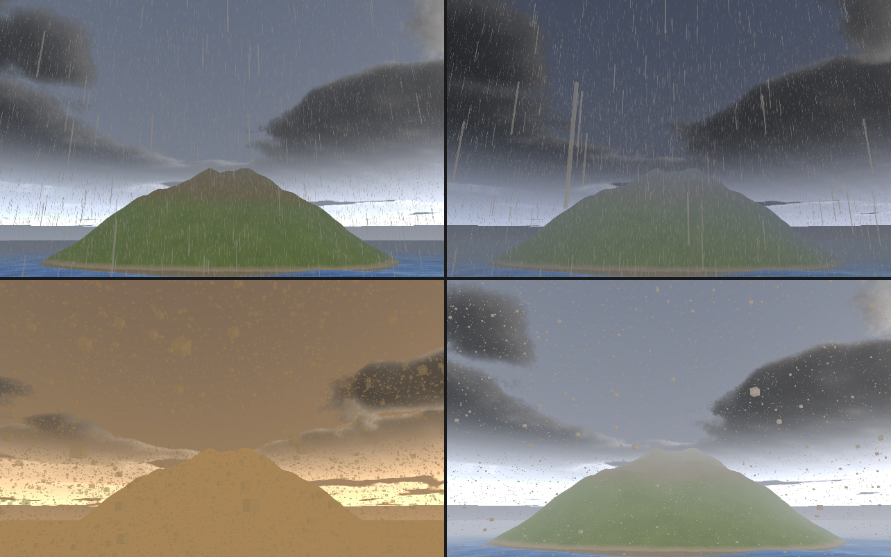

# What the engine draws, and how

The feature list in full, with the reasoning behind each. The [README](../README.md) is the short form.

## Features

- **Two renderers behind one interface.** `Backend` is a vtable both the OpenGL
  and Vulkan renderers fill in; a program picks its renderer with a constructor
  argument and nothing else changes. `tests/test_backend_parity` draws the same
  scene through both and compares them channel by channel across materials,
  textures, instancing, transparency, skybox, FXAA, bloom, shadows, multiple
  lights, a Gerstner ocean, an instanced voxel chunk, the clouds, the
  occlusion and instances placed as points. They agree to within 0.7% of
  channels, and CI fails if the generated Vulkan shaders fall behind the GLSL
  they are made from.
- **The sun by the hour.** `engine_set_time_of_day(hours)` puts the sun where
  the hour does and sets the key light, the fog and a sky drawn from the same
  sun -- blue at noon, gold and red at dusk, moonlit at night -- so the sky,
  the clouds and the light agree; the editor has it as a switch and a slider,
  and the scene file carries the hour.
- **Instances as matrices or as points.** An instanced model carries a
  matrix, a colour and a phase per instance, or -- `model_enable_point_instancing`
  -- a position, a scale, a colour and a phase in eight floats, with the
  model's own rotation and scale applied to all of them in the shader. A
  million grains of sand that all move in a frame are a 32 MB stream
  instead of an 80 MB one built matrix by matrix, on both backends.
- **Skinned crowds in one draw.** A figure's walk is baked once into a pose
  bank (a texture of bone palettes); every instance carries its own phase and
  is posed from the bank in the vertex shader. A crowd of the real 26,636-
  triangle zombie is one instanced call per distance tier, and the bake is
  *in place*: the clip's travel is taken out of the poses and handed back to
  the simulation as speed, so feet plant instead of skating and nothing
  snaps at the loop.
- **A data-oriented ECS** (`ae3d.ecs`): entities as integer handles, components
  in dense columns a system walks in one pass, a crowd rendering straight from
  the position column's buffer. The native crowd step, separation grid and
  distance bucketing are C over those columns.
- **Physically based shading**: metallic/roughness materials, up to four
  directional or point lights, normal mapping, baked per-vertex occlusion and
  screen-space ambient occlusion from the scene's depth (`engine_set_ssao`,
  both backends), shadow mapping with a texel-snapped light box (both
  backends), volumetric clouds and their shadows, a sky drawn from the sun by
  the hour or a painted one, fog applied after tone mapping, MSAA, FXAA and
  bloom. Screen-space reflections on wet surfaces on
  Vulkan.
- **Models compose.** A model keeps its own transform and composes it onto its
  parent's, so bones are ordinary models: a clip exported from Blender drives a
  bone exactly as it drives a part, and `ae3d.ik` solves a limb of bones
  without being told they belong to a skin.
- **Water that is water.** A Gerstner sea with deep-water dispersion, shaded
  as one physically based surface: Schlick fresnel between the body of the
  water and the reflected sky (the scene's own skybox image, where it has
  one), GGX glitter from the sun, light through the crests, whitecaps on the
  steep faces, ripples finer than the mesh from scrolling noise slopes, tone
  mapped and fogged the same way as the shore beside it. The shore itself
  comes from the scene's depth, captured after the opaque pass on both
  backends: shallows go clear over the sand and a foam line runs along the
  waterline. From underneath, the
  surface is the sky through the swell and the seabed is lit by a two-scale
  caustic web with a chromatic fringe.
- **Volumetric clouds.** A layer of cloud marched in the sky shader over
  whatever sky is set, built the way a production sky builds it: a weather
  map says where cloud is and what kind, from a low stratus to a tall
  cumulus; a tileable Perlin-Worley cube gives the body and a Worley
  fractal erodes its edges, wisps at the base and billows above; each
  sample is lit by the sun through the cloud over it, in three octaves of
  Beer's law with the powder darkening and a two-lobe phase, and by the
  sky. The noise is baked once at start into a 2D and a 3D texture
  (`native/ae3d_cloudnoise.c`), so the march is a fetch a sample and the
  clouds are a millisecond and a half of the frame. The ground computes
  the same weather field where the sun's ray meets the layer, so their
  shadows cross the terrain as they drift. One call,
  `engine_set_clouds(cover, wind)`, on either backend.
- **Weather.** `ae3d.weather` puts rain, snow, dust or a storm over any
  scene with one call: `weather_set(w, STORM, 0.8)`. The particles are point
  instances -- a position, a scale, a colour and a phase each, the stream
  the sand's grains use -- stepped in C in a box that rides ahead of the
  camera, so a hundred thousand drops cost a fraction of a millisecond
  wherever the eye goes; rain is a thin streak falling fast, snow a flake
  swaying down, dust a mote carried by the wind. Each kind sets the fog it
  brings, the cloud cover, the sky's overcast (`engine_set_sky_overcast`:
  the sky pulled toward a flat grey or ochre at its own brightness, which
  the clouds' ambient follows) and dims the sun; a storm adds lightning, the
  key light thrown up for three frames every few seconds at the storm's own
  beat. What the weather takes it gives back when set clear: the scene's
  own fog, clouds and overcast as they stood when the weather came
  (`engine_clouds`, `engine_sky_overcast` and their colour and drift are
  what the engine last set), and the key light's intensity, re-taken by
  `weather_relight` when the scene sets its light under the weather. The
  weather is a behaviour the engine runs; `tests/test_weather` holds the
  counts, the box, the sun, the fog, the sky given back and the lightning
  to their numbers. The editor runs the same module over its viewport
  through `engine_over`, an engine wrapped around a renderer somebody else
  draws with ([docs/editor.md](editor.md)); the agent channel sets the
  sky a weather brings by hand (`render.set` with `clouds`, `cloud_wind`,
  `overcast`, `overcast_color`) so a frame under it can be held against
  the clear one.

  

- **Voxel worlds as a face mesh.** Only the faces that show, each corner
  carrying the sky it can see from the three voxels that crowd it -- the
  darkening in a crevice and the light on an edge a voxel world reads by --
  with the block kinds told apart through a palette image the world registers
  in memory. Surface nets over a signed distance field for the smooth kind.
- **Images the engine paints.** The skies, the sand and its normal map, a
  voxel palette, an island's albedo baked from its own height and slope: made
  by the engine from its own noise, registered under a name any texture path
  can use, nothing downloaded and nothing written to disk that need not be.
- **Also:** Perlin terrain, an OBJ/MTL loader, ray casting, keyframe animation
  in glTF's shape (step, linear, cubic), scenes that save and load with
  everything attached to them, a scene editor, and `AE3D_API=vulkan` to run
  any program on the other renderer.

*`AE3D_CROWD=20000 AE3D_NEAR=28 ./build/zombie_city`: the near tier draws the
full mesh, the far tier the build's own 168-triangle stand-in, and past
eighty metres each zombie is a picture; the draw count does not change with
the crowd, and the simulation runs over the engine's job pool on every
core. Twenty thousand hold ~120 fps on an RTX 4070 Ti at 1280x720 with
the GPU shared, half a million 79.*

### Impostors

The third tier of a crowd is a picture. `tools/bake_impostor` bakes a
figure into an atlas: the figure seen from eight angles around it by eight
frames of its walk, posed exactly as the crowd poses it (its gait baked in
place into a pose bank, one instance at the origin), through a lens narrow
enough that the picture is near orthographic. Two atlases, read back
through the engine's capture channel (`engine_set_capture_channel`; no
effect -- post chain, reflections, occlusion -- runs over a channel): the
figure's **albedo**, before any light, and its **normals** in its own
frame. A crowd model whose mesh is one upright quad, given the atlases and
`model_set_impostor(m, cols, rows, width, height)`, draws each instance as
that quad turned to the camera, showing the cell for the angle the camera
sees the instance from (measured around its facing, the instance's own +X,
which is the crowd's yaw zero) and the frame its phase is at; the fragment
cuts it out by the atlas's alpha, turns the baked normal into the world by
the facing, and lights it with the scene's lights, shadow, occlusion and
fog like any surface. A lamp that warms the mesh beside it warms the
picture the same. The transparent pixels of an atlas carry the colour of
the nearest opaque ones (bled outward at the bake), so the texture's filter
and mip levels never blend a key colour into an edge.

### The crowd sorted on the device

On Vulkan a crowd's per-frame sort into its tiers is a compute pass. The
simulation keeps its columns -- a figure's position, yaw, phase and tint
-- and hands them to the device as eight floats a figure
(`device_crowd_update`); `crowd_sort_vk.comp` runs one thread a figure:
its distance to the camera on the ground, dropped past the cull, its tier
by the near and mid bands, its instance matrix from its yaw and the
tier's model's scale (the same matrix the CPU path builds), packed with
its colour and phase into that tier's stream, and counted into the tier's
draw command -- a workgroup at a time, so half a million figures are two
thousand atomics and not half a million. The tiers' models
(`device_crowd_bind`; two can share a tier, a body and its clothes) draw
by those counts through `vkCmdDrawIndexedIndirect`, the shadow pass too
over the same streams with the depth proxy's index count, and nothing
about the sort comes back to the CPU: no matrix is built, sorted or
uploaded there. The renderer records the fill and the sort at the frame's
start, before the shadow pass, once per crowd however many models draw
its tiers, with the barriers between last frame's reads, the reset of the
commands, the dispatch, the copy of the counts to the shadow commands and
the draws. `device_crowd_count` reads the counts of the last frame the
device finished, for a diagnostic. OpenGL 4.1 has no compute and keeps the
CPU sort (`crowd_tiers`); `device_crowd_new` returns null there.

### Motion vectors

Beside its colour, every scene draw writes where its pixel's surface was
last frame: a second colour attachment of the scene pass (R16G16, texture
space, this frame's unnudged position less last frame's; multisampled and
resolved like the colour on Vulkan, a second draw buffer of the post
framebuffers on OpenGL), cleared to zero, so a pixel nothing drew has not
moved. The vertex stage carries the vertex's clip position now and then:
a model from its own matrix of last frame (`model_frame_done` keeps it at
every frame's end) and the last frame's view-projection, unjittered; a
merged batch or an instance stream, which carries no history, from the
camera's motion alone; a crowd figure -- whose slot in the stream is not
its own from frame to frame, since the sort reorders -- from where its
walk puts it: `model_set_crowd_walk(m, seconds)` names the cycle, and the
figure's previous pose is its phase a frame earlier, its previous
position a frame's travel back along its facing, from the pose bank's own
travel; an impostor the same; the sky from the camera's turn. A skinned
palette's previous pose is not carried (a second palette is the OpenGL
uniform budget over); a skinned model's motion is its model's and the
camera's. Capture channel 3 (`engine_set_capture_channel(e, 3)`,
`AE3D_CAPTURE=3`) draws the vector in pixels, a hundred either way across
the byte and 128 for still, and `tests/test_velocity` holds it against the
camera's own projection to the pixel. On Vulkan `ae3d_vk_velocity_texture`
is the resolved target, which is what an upscaler is handed (#324).

### Render scale

`engine_set_render_scale(e, scale)` (0.25..1; `AE3D_RENDER_SCALE=50` for
half) draws the scene at that fraction of the window's size: on both
backends the scene's own targets -- its colour, depth and motion vectors,
and the camera depth, the reflection and the temporal textures over them
-- are made at the scaled size and every pass but the composite runs at
it, and the composite draws the result to the window at the window's
size, which is the upscale. The answer is the scale adopted (clamped), so
a program stepping down a quality ladder knows which rung it got. An
upscaler that knows more than a bilinear sample -- DLSS (#324) -- sits
where the composite samples, handed the scene's colour, depth and motion
vectors at the scaled size and asked for the window's.

### Ray-traced shadows

`engine_set_ray_shadows(e, on)`, or `AE3D_RAYS=1`, on Vulkan where the
device has `VK_KHR_ray_query` (`engine_ray_query(e)` says): a ray from
every lit surface toward the sun through the scene's acceleration
structure, in the shadow map's place for the static scene. Every static
mesh gets a bottom-level structure at upload, from the same vertex and
index buffers the draws use; each frame the renderer adds the traced
models -- the ones that cast, drawn on their own or through a matrix
stream -- with their matrices, and the top-level structure is built
from them before any pass, in a ring of two. The scene fragment's
ray-query variant (`scene_rq_vk.frag`, GLSL 4.60, SPIR-V 1.4, the
structure at binding 5) traces one opaque ray, first hit, from a
little off the surface: lit, or the shadow's share of the light, exact
at any distance and with no map's texel to fit the world into. What the
structure does not hold -- a skinned figure, a point stream, a crowd
not in the rays -- stays in the shadow map, which is drawn with those
alone while the rays are on, and the two shadows combine, the darker
winning. Off, or on a device that does not trace, nothing changes;
`AE3D_NO_RAYS=1` keeps the extensions off. `tests/test_ray_shadows`
holds the rays' shadow to the map's -- the same ground shaded to the
same depth, the same edge -- and past the edge, a ray's ground fully lit
where a map's filtered edge is still part way.

A crowd sorted on the device goes into the rays too:
`crowd.device_crowd_rays(dc, far, bank)` skins the far tier's mesh (a
hundred and sixty-eight triangles) at every frame of the pose bank on
the CPU, once, into a bottom-level structure each, and from then on the
sort's compute pass writes a ray instance for every figure it keeps
that is drawn as a mesh -- where it stands, turned as it walks, the
structure of the frame its walk is at -- straight into the frame's
instance buffer, after the static scene's. The impostors past the far
tier are left out (a card's shadow is not worth a ray), and so is any
figure past the shadow map's distance, which is as far as the map ever
shadowed. The buffer is sized before the sort from what the last frames
wrote back -- the count the sort reaches, kept in a host-visible word,
with a quarter's margin and a floor of four thousand -- and its room is
zeroed first so a slot the sort does not fill is an inactive instance;
the top-level build then takes the whole room, since the instance count
cannot come from the device on hardware without indirect builds.
`tests/test_ray_shadows` stands a device-sorted figure beside the ball
and checks the ground it shades by ray against the map's shadow of it.
Measured in the city: at 400 figures nothing changes; at half a million
the frame goes from 75 to 60 fps with the whole visible horde in the
rays -- that scene packs a thousand figures a square metre, so a shadow
ray crosses hundreds of overlapping structures, a density no game scene
has -- and 20,000 stays at 140.

The sun has a size: `engine_set_sun_size(e, degrees)`, the angle its
disc subtends (`AE3D_SUN_SIZE=n` in tenths of a degree; the real sun is
about half a degree, and zero, the default, is a point sun and a hard
edge). With a size, a lit pixel traces four rays into the cone the disc
subtends, on a spiral turned by a per-pixel noise and by the frame's
jitter, and takes the blocked share: a shadow sharp where it meets what
casts it and soft where the caster stands far off, the way shadows are,
since a far caster covers the disc only partly. A still frame shows the
penumbra as a fine grain; under the temporal pass the frames' taps fold
into a smooth one. `tests/test_ray_shadows` holds a twenty-degree sun to
half-lighting the ball's hard edge while the shadow's middle stays as
dark and the far ground as lit, and a point sun to the hard edge again;
`AE3D_RAY_DUMP=<dir>` writes both frames. The four rays cost about a
millisecond of scene time in the city at 720p (3.4 to 4.5 ms with 400
figures); the shadow map's penumbra is untouched, since only what the
rays shadow takes the size.

Occlusion by ray: `engine_set_ray_occlusion(e, on)`, or `AE3D_RAY_AO=1`,
with the rays and the occlusion (`engine_set_ssao`) both on. The scene
shader traces four cosine-weighted rays into the hemisphere over every
lit pixel, each stopped at the occlusion's reach, on the same turned
spiral as the sun's taps, and darkens by the share that hit -- the share
of the sky the point does not see, from the scene itself, with no screen
edge or hidden surface for a depth-based estimate to miss -- and the
screen-space pass is not drawn. The rays start a hand's breadth out,
since a crowd figure is drawn from its near mesh and traced against its
far one, a few centimetres apart, and a ray from the skin found the
proxy. A still frame shows the grain; under the temporal pass it folds
smooth. `tests/test_ray_occlusion` stands a wall on a plane under a sun
from straight above: the ground at its foot goes darker by ray, the open
ground and the wall's top do not, and off again the screen-space pass is
back. In the city at 720p the opaque pass goes from 1.23 to 1.81 ms
(best of five) and the 0.11 ms screen-space pass is skipped.

What is left for the rays to do next: the skinned figures, so the map
goes; reflections by ray (#323).

### DLSS

NVIDIA's DLSS, through Streamline, on Vulkan: `engine_set_dlss(e, mode)`
before `engine_run`, or `AE3D_DLSS=n` (1 performance, 2 balanced, 3
quality, 4 ultra performance, 6 DLAA; ultra quality is not offered by the
current DLSS). The scene is drawn at the render size the mode wants --
the render scale above, with the scene's textures sampled a mip finer by
`log2(scale)`, so the detail the frame's pixels deserve is in the samples
DLSS reconstructs from, and with no multisampling, since a resolved sample
has none of that detail left -- and DLSS makes the frame from the scene's
colour, its resolved depth and its motion vectors, in the temporal pass's
place, with the same nudged projection (more phases: eight times the
square of the scale). The composite samples what it wrote.

How it is wired (`native/ae3d_dlss.cpp`, C++ against the SDK's headers,
behind the C surface of `native/ae3d_dlss.h`): the Streamline runtime is
loaded before Vulkan starts and its interposer stands in for the Vulkan
loader, so the instance and the device made through it carry what DLSS
needs; each frame the camera's matrices (column-major here, row-major and
row-vector there: the same sixteen floats), the jitter in render pixels
and the motion vectors' scale (texture space, and the other way round:
from where a pixel is to where it was) go in as constants, the four
images are tagged, and the evaluation is recorded between the scene's
passes and the composite. The runtime -- `sl.interposer.dll`,
`sl.common.dll`, `sl.dlss.dll`, `nvngx_dlss.dll` -- is NVIDIA's and not
shipped here: build with `AE3D_STREAMLINE_ROOT` naming the SDK
(github.com/NVIDIA-RTX/Streamline; the C++ shim is compiled only then,
a stub otherwise, so every other machine builds the same), and put the
SDK's `bin/x64` beside the program or in `AE3D_STREAMLINE`. Where DLSS is
not built in, not there or not for the card, the program is told why,
draws as before, and the temporal pass stands in for the multisampling
that was turned off for it. `tests/test_dlss` skips there; on an RTX it
holds the performance mode's frame, from half the pixels, to more than
the composite's own scaling of them and to within a fifth of the native
frame's sharpness.

What it buys depends on where the frame's cost is: `zombie_city` at
1080p with half a million figures, vertex-bound, goes from 73 fps under
the temporal pass to 76 at quality and 84 at performance; a scene bound
by its pixels gains by the render scale.

### Temporal anti-aliasing

`engine_set_taa(e, on)`, or `AE3D_TAA=1`. The projection is nudged a
fraction of a pixel each frame (a Halton sequence over eight frames), so
over frames every pixel sees its surface at eight points within itself,
and a temporal pass folds each frame into a history: each pixel's motion
vector says where its surface was on the screen last frame -- the
camera's motion, the model's, the figure's walk -- and the history read
there is held to the range of colours the pixel's neighbourhood has this
frame, so what the vector does not know of trails no ghost. An edge that
was a staircase is a ramp, and the shading's own aliasing goes with it.
On both backends; the pass runs between the reflection and the composite,
and the two history textures are written in turn.

### Billboards

`model_set_billboard(m, mode)` turns a point-instanced model's mesh to the
eye at every point: upright (mode 1), spun about the world's up alone, so
a streak of rain stays a streak; or full (mode 2), tipped to face the eye
as well, for a flake or a mote. The weather's particles are a quad with a
soft disc for a texture, drawn this way.

### Rain on the surfaces

`engine_set_wetness(e, amount)` is rain on the scene: every surface that
faces up goes darker (its pores filled), smoother, and a mirror at a
grazing angle, so the lamps smear down a wet road; walls, which water
runs off, hardly change. The weather sets it with the rain and the storm
and takes it back with the clear.

### The scene's depth

The occlusion, the reflection and the water read the scene's depth. On
OpenGL it is blitted out of the frame after the opaque draws; on Vulkan the
frame's multisampled depth is resolved into a one-sample target between
the two halves the scene pass is drawn in, the nearest of the samples a
pixel. Both are the depth of what was drawn -- the near figure's real
silhouette, the picture of a far one -- and neither draws anything twice.

## How it is put together

- **Aether never handles float32.** A model owns a native mesh holding
  interleaved position, uv and normal data and, when instanced, a native buffer
  of per-instance matrices. Aether's `float` is a C double; the columns the
  crowd systems walk are doubles and the GPU buffers are floats, converted
  once at upload.
- **The frame's uniforms go up once per program, not once per model.** Of the
  uniforms a draw needs, all but one are the same for every model in the
  frame. Draws that share geometry and a material are merged into one
  instanced draw automatically (`core.set_draw_merging(false)` turns it off).
- **The frame allocates nothing.** `benchmarks/bench_frame.ae` runs the
  heaviest per-frame work two thousand times with no window: 578us to upload
  two hundred thousand instance matrices, under a microsecond each for
  transforms, camera, frustum and water, zero leaked bytes.
- **Only exposed voxels become instances**, and **the viewport readback is
  pipelined** (two pixel buffers, so the CPU never waits on the GPU; the editor
  runs a frame behind, anything comparing what it just drew takes the waiting
  read).
- **Vulkan links nothing.** The loader is opened at runtime, so a program built
  with the Vulkan backend still starts where no driver exists and says so.

